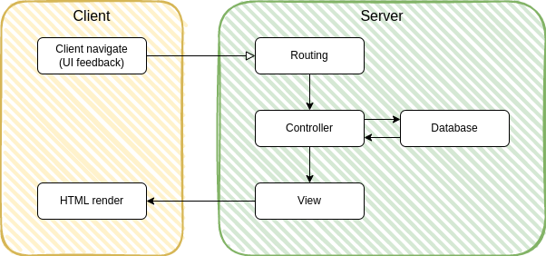

<!-- <head>
  <link rel="canonical" href="https://blog.smile.eu/en/digital/how-choose-right-front-end-architecture" />
</head> -->

Choosing the right frontend framework can indeed be challenging, especially in a rapidly evolving landscape.

The purpose of this article is to assist you in selecting the appropriate architecture by providing an overview of the evolution of frontend frameworks.

<!--truncate-->

To fully grasp the current challenges that frontend frameworks address, it is crucial to explore the different frontend architectures that exist and gain an understanding of their respective advantages and drawbacks.

By examining these architectures, you can develop a solid foundation for evaluating and selecting the most suitable framework for your project.

- First, let's delve into various frontend architectures to gain a comprehensive understanding of the evolution of frontend frameworks.
- Next, we'll shift our attention to the rendering techniques employed by Server Side Rendering (SSR) frameworks.
- Finally, we'll explore different hydration techniques used to enhance interactivity in web applications.

## Architectures

### Multi-Page Apps (MPA)

The Multi-Page App (MPA) was the initial architecture employed when browser capabilities were limited.

In this architecture, the majority of dynamic processes occur on the backend.

Here's how navigation works within an MPA application:



1.  The client navigates through the website (e.g., clicking a link), and the browser provides visual feedback (e.g., displaying a spinner in the tab).
2.  Routing takes place on the backend.
3.  Data is fetched from the database.
4.  The backend generates the HTML, which is then sent back to the client.
5.  The browser renders the HTML.

Here's another example that involves a redirect after form submission (a well-known pattern used to prevent form resubmission when the page is refreshed):


1.  The client submits a form, resulting in UI feedback.
2.  Routing occurs, and the backend manages the data.
3.  The backend instructs the browser to redirect the user.
4.  The browser automatically redirects the user to the new page, providing UI feedback once again.
5.  The backend then generates the HTML for the new page.
6.  Finally, the browser renders the HTML.

What are the advantages of such an architecture?

1.  It is straightforward to comprehend since all logic resides on the backend, eliminating additional complexity.
2.  UI feedback is handled by the browser.

And what are the disadvantages?

1.  It involves full-page refreshes, requiring the reloading of frontend assets every time.
2.  Some tasks can be challenging to accomplish, such as managing focus or scroll position after form submission for example.
3.  Certain tasks are impractical, for instance, experiencing a full-page refresh every time an item is added to the favorites list.
4.  Some tasks are simply impossible, like animated page transitions.
5.  Managing state can be tricky, involving the utilization of cookies and other techniques.
6.  UI feedback is limited and not closely associated with the element the user interacted with.

Due to these limitations, alternative architectures were introduced.

### Progressively Enhanced Multi-Page Apps (PEMPA)

Progressive Enhancement is the concept that our web applications should be functional and accessible to all web browsers, and then utilize additional browser capabilities to enhance the user experience (e.g., using JS and AJAX for improved UX).

Here's what happens when the user loads the website for the first time:


1.  The client loads the website, arriving from a Google search, for example.
2.  Similar to MPA, the backend generates the HTML and sends it back to the client.
3.  The browser renders the HTML, and JavaScript is loaded.

Now, let's consider the case where we use JavaScript to leverage browser history when the page is already loaded:


1.  The client navigates within the website.
2.  JavaScript intercepts the default browser behavior, adds an item to the browser's navigation history, and changes the browser's URL (no browser feedback).
3.  Data is fetched from the backend using AJAX.
4.  On the backend side, the view component is no longer present, and data is usually sent back to the frontend in JSON format.
5.  The frontend receives the data and renders the new UI.

So, what is the advantage?

1.  Significantly improved user experience (that's the primary goal).

And what about the disadvantages?

1.  More aspects to manage manually (e.g., form resubmission, error handling, spinners, etc.).
2.  Increased amount of code on both the frontend and backend, which can potentially lead to more bugs.
3.  Code duplication between the backend and frontend (the same UI needs to be available on both sides due to Progressive Enhancement).
4.  Reliance on imperative code (with or without jQuery) that can be difficult to follow.
5.  If a change is made on one side of the network (backend/frontend), the other side needs to be updated as well.

While the UX is enhanced, it comes at a clear cost, which is why new architectures have been introduced.

### Single Page Applications (SPA)

To address the issue of code duplication while maintaining an enhanced user experience, the solution is to separate and remove the UI code from the backend. This is the core idea behind Single Page Applications (SPA).

Here's what happens when the user initially loads the website:


1.  The client loads the website.
2.  The backend sends the HTML to the client, however, at this point, the HTML is mostly empty (most of the time we only store a HTML file behind a web server).
3.  The browser renders the nearly empty HTML, and the JavaScript is loaded.
4.  Depending on the browser's URL, the JavaScript will fetch data from the API server.
5.  The backend sends the data (most of the time using the JSON format).
6.  JavaScript renders the UI based on the URL.

After the initial load, navigation follows a similar pattern as in the PEMPA scenario:


The advantages of SPA are:

1.  Continued improvement in user experience.
2.  Enhanced developer experience.
3.  Elimination of code duplication.
4.  Declarative code thanks to JSX or similar approaches.
5.  Utilization of modern tooling.

However, there are some drawbacks:

1.  SEO issues.
2.  Larger bundle sizes.
3.  Longer initial load times and potential waterfall issues (waiting for components to load before fetching data).
4.  Reduced runtime performance on lower-powered devices.
5.  Complex state management.

Now, the problem of SEO (and sometimes performance) needs to be addressed, which leads us to the next architecture.

### Server-Side Rendered Single Page Applications (SSRSPA)

To address the SEO problem, rendering the application on the server during the initial load is required.

In this case, the application loads similarly to the PEMPA scenario from the point of vue of the client:


1. The client loads the website.
2. Then the node server fetch the data from the API server.
3. And use the data to build the view (as it would be done on the client side in the SPA architecture).
4. The browser renders the HTML and loads the JavaScript.
5. When the JavaScript is loaded, we use the term "hydration" to describe the process of making the page interactive.

This "hydration" process is similar to the rendering that occurs on the backend, where the component tree is transformed into HTML.

In this case, it's done on the client and the generated virtual DOM is used to add event listeners to the existing DOM elements.

The navigation can follow either the same pattern as the MPA scenario or the same pattern as the PEMPA/SPA scenario, depending on the rendering technique employed (explained in the next section).

The advantages of this architecture are:

1.  Improved user experience.
2.  Enhanced developer experience, including elimination of duplication, declarative code, and improved tooling.
3.  No more SEO issues (although this may not be considered an advantage by some).
4.  Potentially improved performance, depending on the rendering technique used.

However, there are some disadvantages:

1.  State management remains challenging.
2.  The ability to execute JavaScript on the server side is required.

## Rendering Techniques

The following techniques are all Server Side Rendering techniques (SSR) that involve processing components on the backend to generate HTML in the HTTP response and address SEO issues. They differ from Client Side Rendering (CSR) used by SPA architecture, which renders content on the client side only.

### Dynamic Rendering (DR)

In this technique, the page is dynamically generated on the server. It was primarily used to solve the SEO problems of SPA architecture by rendering frontend framework components on the server and sending the generated output to the client.

However, in terms of performance, it is not necessarily superior to Client Side Rendering (CSR) used by SPA architecture (without utilizing server-side caching).

The time taken to render the UI is similar, whether it occurs on the server for DR or on the frontend for CSR.

In fact, it may even be worse due to the hydration phase (explained in the next section).

Dynamic Rendering is available in frameworks such as Next.js (React), Gatsby (React), Nuxt (Vue), and others.

As previously mentioned, compared to CSR (SPA), the advantages of Dynamic Rendering are:

1.  No SEO issues.

However, there are some disadvantages:

1.  The page is generated on the backend, requiring Node.js and consuming more server resources than CSR.
2.  Caching is necessary to improve performance.
3.  Cache invalidation based on backend changes can be challenging.
4.  The page needs to be hydrated on the client side for interactivity.
5.  The content generated by the server and the client during hydration may differ (e.g., when using JavaScript for responsiveness).

### Static Site Generation (SSG)

In the Static Site Generation (SSG) technique, pages are generated ahead of time during the build phase.

The pages are then stored as static HTML files and served as static content.

This technique is also supported in frameworks like Next.js (React), Gatsby (React), Nuxt (Vue), and others.

SSG offers the following advantages:

1.  No SEO problems.
2.  Minimal server load.
3.  Fast page loading.

However, there are some drawbacks:

1.  Pages are generated during the build phase and remain fully static until the next build.
2.  The build process can be time-consuming.
3.  All pages need to be generated during the build.
4.  The page still requires hydration on the client side to become interactive.

### Incremental Static Regeneration (ISR)

Incremental Static Regeneration (ISR) is a rendering technique that combines the benefits of SSR and SSG.

Similar to SSG, pages are generated ahead of time during the build phase.

However, there are two options for how to handle page updates:

1\. Time-based revalidation: You can specify a time interval during which the page will be cached.

- Initially, the static page is served for all requests.
- When the specified time expires, the framework generates a new version of the page in the background.
- Subsequent requests will then use the updated page.

2\. On-demand revalidation: Your back-office system can inform the framework whenever there are changes, triggering the regeneration of specific pages. This allows for dynamic updates without relying solely on a predetermined time interval.

Next.js (React) supports both time-based and on-demand revalidation, while Nuxt (Vue) currently only supports time-based revalidation.

The advantages of ISR include:

1.  SEO compatibility.
2.  Reduced server load compared to SSR.
3.  Fast page loading.
4.  Ability to have dynamic content.

However, there are some considerations:

1.  Time-based revalidation may result in potential cache issues, as older content may be served until the cache expires.
2.  Implementing revalidation logic between the front-office and back-office is necessary for on-demand revalidation.
3.  Page hydration is still required for interactivity.

### Jamstack

From [Jamstack.org](https://jamstack.org/) :

Jamstack is an architectural approach that decouples the web experience layer from data and business logic, improving flexibility, scalability, performance, and maintainability.

The core principles of Jamstack include:

- Decouple Building and Hosting
- Decouple Frontend and Backend
- Use APIs rather than databases (expose data through APIs, use external tools...etc.)
- Generate pre-baked markup, enhanced with JS

In practice, a Jamstack setup involves the following steps:

1.  Generating pre-rendered static markup using a Static Site Generator.
2.  Hosting the static assets on a CDN (Content Delivery Network).
3.  Enhancing the static markup with JavaScript using a frontend framework.
4.  Integrating with backend APIs for dynamic content.
5.  Storing the entire project in a version control system like Git.
6.  Utilizing automated builds to streamline the deployment process.

The advantages of using Jamstack include:

1.  SEO compatibility, allowing for better search engine visibility.
2.  Reduced server load due to serving static assets from a CDN.
3.  Fast page loading times for improved user experience.
4.  The ability to incorporate dynamic content through backend APIs.

However, there are some considerations:

1.  Content management and updates should be handled through version control systems like Git.
2.  For content that live in database, custom logic is required to generate data inside Git (and also maybe to trigger a new build).
3.  Page hydration is still necessary for interactivity on the client side.

### Summary

We can summarize the different rendering technique in the following table:

<!--  -->

|                 | `CSR` | `SSR` | `SSG` | `ISR` | JamStack |
| --------------- | ----- | ----- | ----- | ----- | -------- |
| SEO friendly    | ❌    | ✅    | ✅    | ✅    | ✅       |
| Server load     | ✅    | ❌    | ✅    | ✅    | ✅       |
| Loading time    | ❌    | ❌    | ✅    | ✅    | ✅       |
| Dynamic content | ✅    | ✅    | ❌    | 🔶    | 🔶       |
| Serverless      | ✅    | ❌    | ✅    | ❌    | ✅       |

Legend:

- ✅ : OK
- ❌ : KO
- 🔶 : Moderately OK

## Hydration techniques

When utilizing SSR (Server-Side Rendering), the server sends the HTML to the browser, which then renders it. However, until the JavaScript is loaded, the user will not be able to interact with the page.

The purpose of hydration is to enable interactivity on the page by attaching event listeners to the server-generated DOM structure.

The different techniques serve the purpose of enhancing performance, aiming to make the page interactive for the user as quickly as possible upon receiving the response from the server.

### Static Routes

In fact, if there are no interactions on certain pages, there is no need to perform hydration on them.

In such cases, there is also no need to send any JavaScript to the client.

This may seem obvious, but not all frameworks have the capability to avoid sending any JavaScript altogether.

In such cases, we end up with the MPA (Multi-Page Application) architecture, as without any JavaScript, there won't be any client-side routing.

This technique is available in the following frameworks: Remix, Sveltekit and SolidStart.

### Classical hydration

When using classical hydration, the component tree structure is generated on the server to create the HTML.

However, on the client side, the tree structure is generated again so that the library can compare the existing HTML and bind events to the appropriate elements.

[The first video of this link](https://www.patterns.dev/posts/progressive-hydration) shows what happen in the browser during classical hydration.

This is essentially what occurs when using Next.js with the old Pages Router.

### Progressive hydration (or Lazy Hydration)

The purpose of progressive hydration is to utilize dynamic components to defer the loading of non-urgent components and prioritize the hydration of urgent components.

This technique requires manual implementation by the developer, who decides which components should be lazy loaded and how they should load.

[The second and third videos of this link](https://www.patterns.dev/posts/progressive-hydration) demonstrate the differences between classical hydration and progressive hydration.

The technical requirements for progressive hydration implementation are as follows:

1.  Allows usage of SSR for all components.
2.  Supports splitting of code into individual components or chunks.
3.  Supports client side hydration of these chunks in a developer defined sequence.
4.  Does not block user input on chunks that are already hydrated.
5.  Allows usage of some sort of loading indicator for chunks with deferred hydration.

### Selective Hydration

The idea behind selective hydration is to return an incomplete response from the server.

By streaming the response, we can receive some response from the backend even if some queries have not finished yet.

Using this technique, we can start loading JavaScript even when the page is incomplete in order to begin hydration on the possible elements.

When we receive the query response, we can send it back to the browser, which will replace the incomplete UI and then hydrate the new page chunk, [as shown in the videos in this page](https://www.patterns.dev/posts/react-selective-hydration) .

This feature was introduced in React 18 with [renderToPipeableStream](https://github.com/reactwg/react-18/discussions/37) and implemented in [Next.js](https://nextjs.org/docs/app/building-your-application/routing/loading-ui-and-streaming#example).

### Partial Hydration (Islands Architecture)

Partial hydration is kind of an updated version of Static Routes.  
The purpose of islands is to hydrate at the component level, rather than the entire page.  
This technique can be used when only certain components need to be interactive.  
Anything outside these islands/components will never change and will not be interactive.  
This technique is used by Astro, Marko, Fresh, and 11ty.  
And it is also available in Next.js or Gatsby using React Server Components.

### Resumable application

This concept is used by Qwik.  
The idea behind a resumable application is to serialize the state of the application on the server and then resume from that point on the client.  
Even event handlers get serialized, like in this example:

```html
<button on:click="q-671f8656.js#s_D04jAYuCnhM[0 1]">click me</button>
```

Qwik also extensively utilizes lazy loading to load JavaScript only when needed, such as when clicking on the button in the above example.

This allows for an app that sends minimal inlined JavaScript on the initial load but remains highly interactive.

### Summary

All of these techniques yield different performance results and may have limitations. However, it is not necessary to compare them extensively.  
Major frameworks consider these techniques and continuously evolve to offer new performance improvements.  
In most cases, if your application is slow, it is likely not due to the hydration technique being used.  
Therefore, hydration will probably not be an issue if you follow the framework documentation, but it's still valuable to be aware of these techniques.

## Conclusion

### Do we need a frontend framework ?

The decision to use a frontend framework depends on the specific requirements of the project.

Here are the pros in favor of using a frontend framework:

- Maintainability and scalability
- Fast and delightful user experience
- Standardized front-end approach
- Quick prototyping and development

On the other hand, there are some cons to consider:

- Complexity for simple projects
- Difficulty integrating with backend tools
- Opinionated nature of frameworks
- Requires training and familiarity

In summary, it is recommended to use a frontend framework when you have a complex frontend with a significant number of user interactions.

### Headless or not ?

Headless architecture is not always the solution.

If you only need some interactions on certain pages, you can use frontend frameworks for those specific components without using them for the entire page.

Here are some considerations for different frameworks:

- React can be used to render specific components, but it is not SEO-friendly (only for parts rendered with React).
- Vue.js can be used in Progressive Enhancement mode, as it is based on the HTML served by the server and is SEO-friendly.
- Angular is not well-suited for this scenario.
- Some frameworks, like Alpine.js, are designed specifically for this use case.

### SEO or not ?

If SEO is not a requirement, client-side rendering (CSR) frameworks are usually sufficient.

Examples of scenarios where SEO is not critical include:

- Backend offices or admin panels
- Apps that require authentication
- Apps without indexable content (e.g.: [Excalidraw](https://excalidraw.com/) )

### Choosing the Rendering Technique

1.  If the content is in the source code → JamStack can be used.
2.  If you are building a website with infrequent changes → Static Site Generation (SSG) can be used.
3.  If you can implement a content update logic → Incremental Static Regeneration (ISR) with on-demand revalidation can be used.
4.  If you want to utilize time-based caching → ISR with time-based revalidation can be used.
5.  Otherwise, server-side rendering (SSR) is recommended.

### Wrap up

To summarize, the decision on using a frontend framework, headless architecture, SEO considerations, and rendering technique should be based on the specific requirements of the project.  
The schema below provides a visual representation that can assist in choosing the appropriate architecture with the corresponding rendering technique:


Please note that this schema serves as a helpful guideline, but there may be certain edge cases where it may not fully apply. It's important to consider the unique characteristics and needs of your project when making these decisions.

### Resources

[https://www.epicweb.dev/the-webs-next-transition](https://www.epicweb.dev/the-webs-next-transition)  
[https://buchet.tech/blog/csr-ssr-ssg-isr-wtf](https://buchet.tech/blog/csr-ssr-ssg-isr-wtf)  
[https://www.sitepen.com/blog/intro-to-html-first-frontend-frameworks](https://www.sitepen.com/blog/intro-to-html-first-frontend-frameworks)  
[https://www.patterns.dev/](https://www.patterns.dev/)  
[https://dev.to/this-is-learning/why-efficient-hydration-in-javascript-frameworks-is-so-challenging-1ca3](https://dev.to/this-is-learning/why-efficient-hydration-in-javascript-frameworks-is-so-challenging-1ca3)
