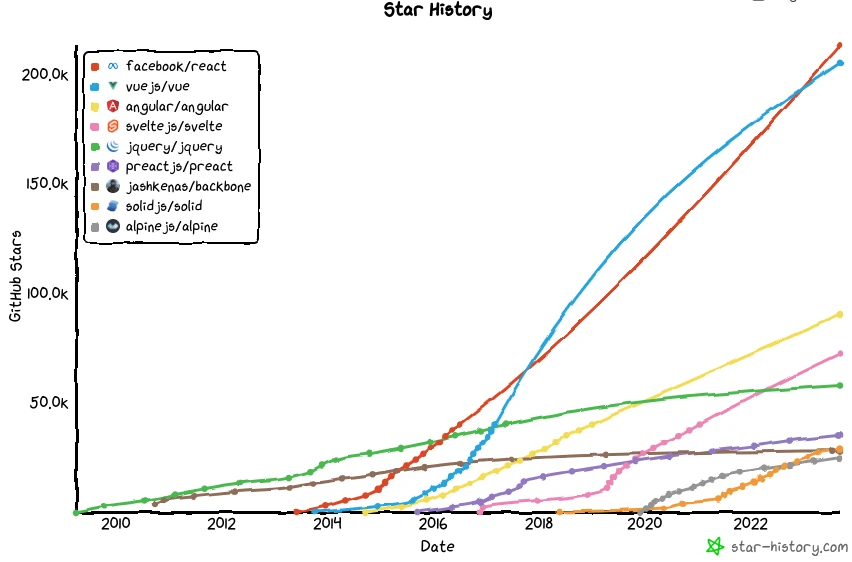
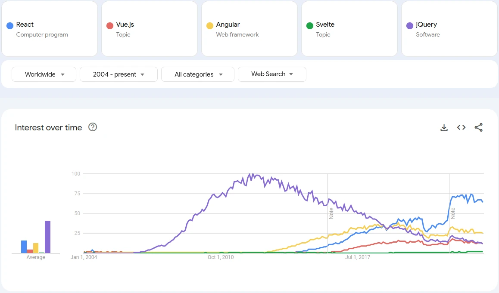
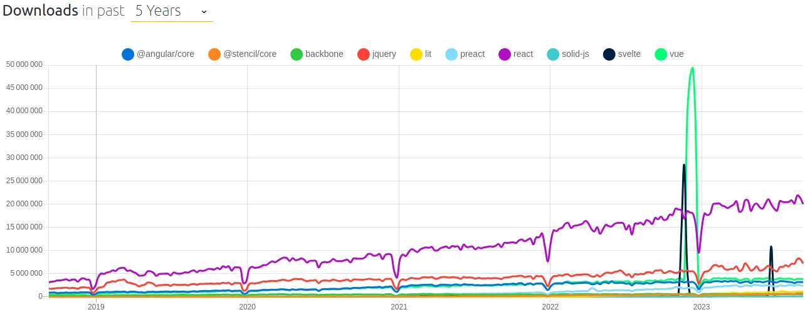
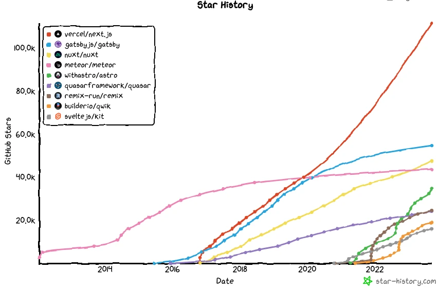
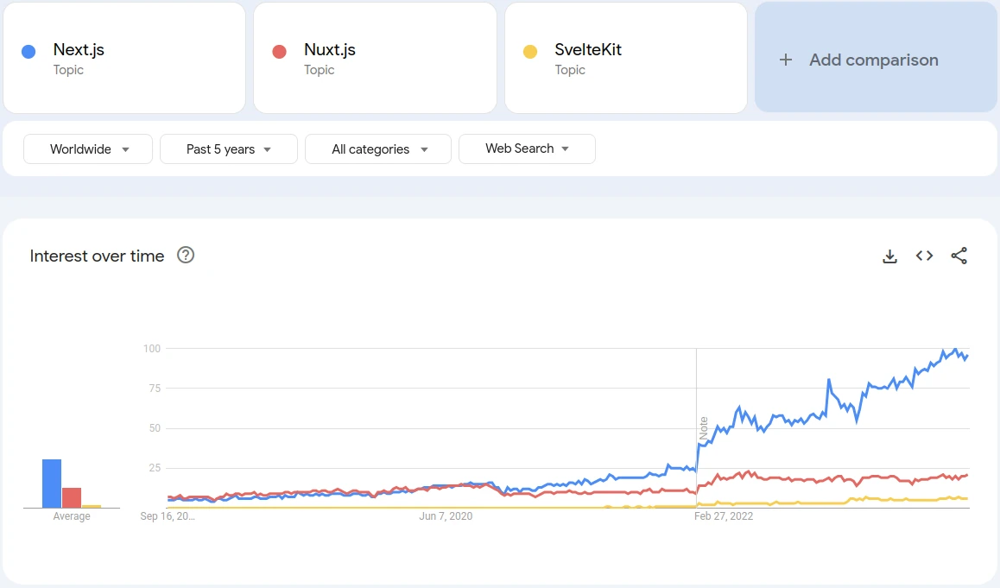
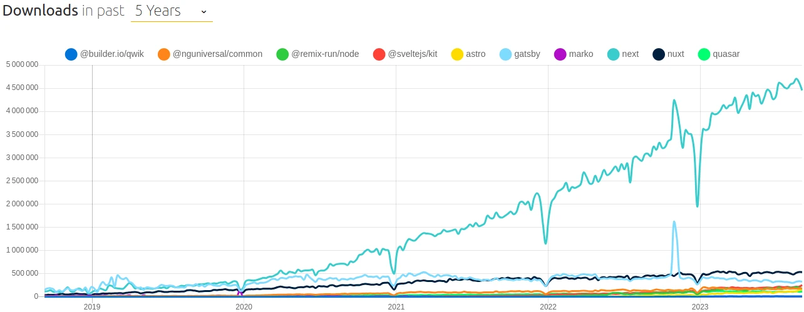

<head>
  <link rel="canonical" href="https://smile.eu/en/publications-and-events/what-frontend-framework-should-you-choose" />
</head>

This article serves as a follow-up to my previous article on front-end architecture, which can be found [here](/blog/posts/front-end-architecture). While it's not necessary to have read the previous article before reading this one, if you're looking to make the best choice for selecting your frontend framework, it would be beneficial to take a look.

In this article, our main focus will be on effectively comparing different frameworks by examining various data, statistics, surveys, and more.

<!--truncate-->

Here's an outline of what we'll cover:

1. We'll begin by exploring client-side technologies such as React, Vue.js, and others (referred to as frontend frameworks).
2. Next, we'll shift our attention to server-side technologies, which are often decided for their Server-Side Rendering capability (referred to as rendering frameworks).
3. Lastly, we'll present some excellent contenders for frontend frameworks that you might consider.

## Frontend frameworks

Frontend frameworks are used to facilitate the development of intricate frontend applications.

These frameworks can be employed independently in the Single-Page Application (SPA) architecture or in conjunction with rendering frameworks in the Server-Side Rendered Single-Page Application (SSRSPA) architecture.

Now, let's delve into the available data concerning these frameworks (you will also find jQuery in the list I added for comparison).

### GitHub statistics

Here are some statistics retrieved from GitHub that primarily indicate the popularity and interest for each framework. The statistics are sorted in descending order based on the number of stars (as of September 12, 2023):

| Framework                                                                       | Star         | Fork         | Watch        | Contributors  | Last commit             | Created                 |
| ------------------------------------------------------------------------------- | ------------ | ------------ | ------------ | ------------- | ----------------------- | ----------------------- |
| [React](https://github.com/facebook/react)                                      | 213k         | 44.7k        | 6.7k         | 1629          | 12/09/2023              | 24/05/2013              |
| [Vue.js v3](https://github.com/vuejs/core) ([v2](https://github.com/vuejs/vue)) | 40.1k (205k) | 7.3k (34.4k) | 765 (6k) | 407 (358) | 06/09/2023 (27/04/2023) | 12/06/2018 (29/07/2013) |
| [Angular](https://github.com/angular/angular)                                   | 90.1k        | 24.2k        | 3k           | 1774          | 11/09/2023              | 18/09/2014              |
| [Svelte](https://github.com/sveltejs/svelte)                                    | 72.4k        | 4k           | 869          | 635           | 04/09/2023              | 20/11/2016              |
| [jQuery](https://github.com/jquery/jquery)                                      | 57.8k        | 20.9k        | 3.2k         | 284           | 12/09/2023              | 03/04/2009              |
| [Preact](https://github.com/preactjs/preact)                                    | 35k          | 1.9k         | 407          | 300           | 11/09/2023              | 11/09/2015              |
| [Solid.js](https://github.com/solidjs/solid)                                    | 28.9k        | 802          | 217          | 150           | 11/09/2023              | 24/04/2018              |
| [Backbone](https://github.com/jashkenas/backbone)                               | 28k          | 5.5k         | 1.3k         | 324           | 11/08/2023              | 30/09/2010              |
| [Alpine.js](https://github.com/alpinejs/alpine)                                 | 24.8k        | 1.1k         | 213          | 242           | 11/09/2023              | 28/11/2019              |
| [Ember](https://github.com/emberjs/ember.js)                                    | 22.4k        | 4.3k         | 868          | 820           | 08/09/2023              | 25/05/2011              |
| [Lit](https://github.com/lit/lit)                                               | 15.7k        | 814          | 207          | 160           | 12/09/2023              | 29/06/2017              |
| [Omi](https://github.com/Tencent/omi)                                           | 12.7k        | 1.3k         | 346          | 90            | 11/09/2023              | 31/05/2015              |
| [Stencil](https://github.com/ionic-team/stencil)                                | 11.9k        | 757          | 183          | 191           | 12/09/2023              | 15/02/2017              |

### GitHub star history

By utilizing [Star history](https://star-history.com/), we can generate an image illustrating the GitHub star history for various frameworks over time. This image provides us with valuable insights into the trends and levels of popularity (indicated by the shape of the curve, particularly rapid increases) for these frameworks:

It's important to note that the star count for Vue.js version 2 appears to be decreasing due to a repository change for version 3\. As a result, the older version (v2) is not experiencing significant growth in popularity, while the newer version (v3) is steadily increasing but has not yet reached the same level as the v2 version. It is not advisable to simply combine the star counts for v2 and v3, as there is likely some overlap or intersection between the two.

[Click here](https://star-history.com/#facebook/react&vuejs/vue&angular/angular&sveltejs/svelte&jquery/jquery&preactjs/preact&jashkenas/backbone&solidjs/solid&alpinejs/alpine&Date) to view an updated graph based on the date you're reading this article (you will need to provide a GitHub token).

### Google trends

By utilizing [Google trends](https://trends.google.com/), we can generate an image that illustrates the search trends on Google. This image provides valuable insights into the relative popularity and interest over time for various frameworks based on search queries:

[Click here](https://trends.google.com/trends/explore?date=all&q=%2Fm%2F012l1vxv,%2Fg%2F11c0vmgx5d,%2Fg%2F11c6w0ddw9,%2Fg%2F11c5t00h04,%2Fm%2F0268gyp&hl=en) to view an updated graph based on the date you're reading this article.

### npm trends

By referring to [npm trends](https://npmtrends.com/), we can obtain the number of downloads for various frameworks, providing insights into their usage. The download statistics indicate the level of adoption and utilization for each framework:

[Click here](https://npmtrends.com/@angular/core-vs-@stencil/core-vs-backbone-vs-jquery-vs-lit-vs-preact-vs-react-vs-solid-js-vs-svelte-vs-vue) to view an updated graph based on the date you're reading this article.

### Stack Overflow 2023 survey

[Here](https://survey.stackoverflow.co/2023/#section-most-popular-technologies-web-frameworks-and-technologies) is a survey result from Stack Overflow about popular technologies and how much they are admired (people that have used and want to continue using it) or desired (people that want to use it) by developers.

We can extract the following information regarding the list of frameworks we want to focus on in this section:

| Framework | Used   | Desired | Admired |
| --------- | ------ | ------- | ------- |
| React     | 40.58% | 35.25%  | 62.61%  |
| jQuery    | 21.98% | 8.59%   | 32.89%  |
| Angular   | 17.46% | 13.86%  | 50.75%  |
| Vue.js    | 16.38% | 17.42%  | 57.87%  |
| AngularJS | 7.21%  | 4.21%   | 19.22%  |
| Svelte    | 6.62%  | 14.18%  | 74.50%  |
| Solid.js  | 1.36%  | 4.93%   | 71.71%  |
| Lit       | 0.68%  | 0.92%   | 55.71%  |

### State of JS 2022 survey

[Here](https://2022.stateofjs.com/en-US/libraries/front-end-frameworks/) is another survey result from State of JS showing the percentage of people that knows some frameworks, have used them, are interested in them or who would use them again.

We can extract the following information regarding the list of frameworks we want to focus on in this section:

| Framework | Awareness | Usage | Interest | Retention |
| --------- | --------- | ----- | -------- | --------- |
| React     | 99.9%     | 81.8% | 47.2%    | 83.0%     |
| Angular   | 99.6%     | 48.8% | 20.4%    | 42.7%     |
| Vue.js    | 99.5%     | 46.2% | 50.7%    | 77.4%     |
| Svelte    | 93.6%     | 21.2% | 69.8%    | 89.7%     |
| Ember     | 77.0%     | 7.5%  | 13.4%    | 17.1%     |
| Preact    | 76.1%     | 12.8% | 35.6%    | 74.3%     |
| Solid.js  | 65.9%     | 6.3%  | 65.7%    | 90.9%     |
| Alpine.js | 51.6%     | 6.2%  | 32.7%    | 76.1%     |
| Lit       | 41.7%     | 6.2%  | 36.8%    | 70.8%     |
| Stencil   | 35.4%     | 4.3%  | 32.7%    | 62.6%     |

### State of Frontend 2022 survey

[Here](https://tsh.io/state-of-frontend/#over-the-past-year-which-of-the-following-frameworks-have-you-used-and-liked) is another survey result from State of Frontend showing the percentage of people that used and liked or disliked some framework and the percentage of people who would like to learn some framework.

We can extract following the information regarding the list of frameworks we want to focus on in this section:

| Framework | Liked | Disliked | Like to learn |
| --------- | ----- | -------- | ------------- |
| React     | 76.2% | 25.0%    | 16.2%         |
| Vue.js    | 28.9% | 17.0%    | 28.1%         |
| Angular   | 22.0% | 51.0%    | 8.0%          |
| Svelte    | 16.9% | 4.6%     | 49.2%         |
| Ember     | 4.5%  | 9.4%     | 3.2%          |
| Backbone  | 1.9%  | 11.3%    | 1.3%          |

### JetBrains 2022 survey

[Here](https://www.jetbrains.com/lp/devecosystem-2022/javascript/) is another survey result from JetBrains showing the percentage of people that use some framework.

We can extract the following information regarding the list of frameworks we want to focus on in this section:

| Framework  | Using |
| ---------- | ----- |
| React      | 55%   |
| Vue.js     | 35%   |
| Angular    | 17%   |
| Angular.js | 7%    |
| Svelte     | 5%    |

### Jamstack.org 2022 survey

[Here](https://jamstack.org/survey/2022/#frameworks-by-usage-and-satisfaction) is another survey result from Jamstack.org showing the percentage of people that use some framework and the satisfaction to use that framework.

We can extract the following information regarding the list of frameworks we want to focus on in this section:

| React      | 71% | 2.9 |
| ---------- | --- | --- |
| jQuery     | 44% | 0.3 |
| Vue.js     | 33% | 3.1 |
| Angular    | 20% | 0.7 |
| Svelte     | 19% | 5.3 |
| Angular.js | 14% | 0.3 |
| Preact     | 12% | 2.0 |
| Solid      | 6%  | 2.0 |
| Stencil    | 5%  | 1.5 |

### Market share

We can gather market share data for various frameworks using the following tools:

- [Built With](https://trends.builtwith.com/javascript)
- [SimilarTech](https://www.similartech.com/categories/javascript)
- [Datanyze](https://www.datanyze.com/market-share/frameworks-and-libraries--66)
- [Wappalyzer](https://www.wappalyzer.com/technologies/javascript-frameworks/)

Here is the data we can collect from the following sources as of September 12, 2023:

| Framework  | Built With                                                  | SimilarTech                                                 | Datanyze                                                                                           | Wappalyzer                                                                         |
| ---------- | ----------------------------------------------------------- | ----------------------------------------------------------- | -------------------------------------------------------------------------------------------------- | ---------------------------------------------------------------------------------- |
| jQuery     | [79.3M](https://trends.builtwith.com/javascript/jQuery)     | [19.1M](https://www.similartech.com/technologies/jquery)    | [12.9M](https://www.datanyze.com/market-share/frameworks-and-libraries--66/jquery-market-share)    | [5M](https://www.wappalyzer.com/technologies/javascript-libraries/jquery/)         |
| React      | [12.4M](https://trends.builtwith.com/javascript/React)      | [1.4M](https://www.similartech.com/technologies/react-js)   | [500k](https://www.datanyze.com/market-share/frameworks-and-libraries--66/react-market-share)      | [2.3M](https://www.wappalyzer.com/technologies/javascript-frameworks/react/)       |
| Vue.js     | [1.7M](https://trends.builtwith.com/javascript/Vue)         | [343k](https://www.similartech.com/technologies/vuejs)      | [87k](https://www.datanyze.com/market-share/frameworks-and-libraries--66/vue-market-share)         | [663k](https://www.wappalyzer.com/technologies/javascript-frameworks/vue-js/)      |
| Angular.js | [1.0M](https://trends.builtwith.com/javascript/Angular-JS)  | [390k](https://www.similartech.com/technologies/angular-js) | -                                                                                                  | [271k](https://www.wappalyzer.com/technologies/javascript-frameworks/angularjs/)   |
| Backbone   | [1.0M](https://trends.builtwith.com/javascript/Backbone.js) | [784k](https://www.similartech.com/technologies/backbonejs) | [17k](https://www.datanyze.com/market-share/frameworks-and-libraries--66/backbone.js-market-share) | [444k](https://www.wappalyzer.com/technologies/javascript-frameworks/backbone-js/) |
| Alpine.js  | [144k](https://trends.builtwith.com/javascript/Alpine.js)   | -                                                           | -                                                                                                  | [48k](https://www.wappalyzer.com/technologies/javascript-frameworks/alpine-js/)    |
| Lit        | [113k](https://trends.builtwith.com/javascript/Lit)         | -                                                           | -                                                                                                  | -                                                                                  |
| Angular    | [98k](https://trends.builtwith.com/javascript/Angular)      | -                                                           | [89k](https://www.datanyze.com/market-share/frameworks-and-libraries--66/angular-market-share)     | [209k](https://www.wappalyzer.com/technologies/javascript-frameworks/angular/)     |
| Ember      | [32k](https://trends.builtwith.com/javascript/Ember)        | [13k](https://www.similartech.com/technologies/ember-js)    | -                                                                                                  | [27k](https://www.wappalyzer.com/technologies/javascript-frameworks/ember-js/)     |
| Svelte     | [31k](https://trends.builtwith.com/framework/Svelte)        | -                                                           | -                                                                                                  | [25k](https://www.wappalyzer.com/technologies/javascript-frameworks/svelte/)       |
| Solid.js   | -                                                           | -                                                           | -                                                                                                  | [5k](https://www.wappalyzer.com/technologies/javascript-frameworks/solidjs/)       |

### Summary

Here's a summary based on the collected data:

| Frameworks | Popularity | Love/Interest | Usage  |
| ---------- | ---------- | ------------- | ------ |
| jQuery     | ➕➕       | ➖➖          | ➕➕➕ |
| React      | ➕➕➕     | ➕➕          | ➕➕   |
| Vue.js     | ➕➕       | ➕➕          | ➕     |
| Angular    | ➕➕       | ➖            | ➕     |
| Svelte     | ➕         | ➕➕➕        | ➖     |
| Preact     | ➖         | ➕            | ➖     |
| Backbone   | ➖         | ➖➖          | ➖     |
| Solid      | ➖         | ➕➕➕        | ➖➖   |
| Alpine.js  | ➖         | ➕            | ➖➖   |
| Ember      | ➖         | ➖➖          | ➖➖   |
| Lit        | ➖➖       | ➕            | ➖     |
| Omi        | ➖➖       | ➖➖          | ➖➖   |
| Stencil    | ➖➖       | ➕            | ➖     |

In the table above, the more ➕ symbols indicate higher levels of popularity, love/interest, or usage, while the more ➖ symbols represent lower levels of popularity, love/interest, or usage.

Please note that this summary is based on the data collected and the assessment of each framework across these different aspects.

If you want, you can jump to the article’s conclusion directly.

## Rendering frameworks

Rendering frameworks are frequently built upon frontend frameworks, although this is not always the case.

They serve as an excellent solution for delivering an exceptional user experience while ensuring that website content remains indexable by search engines.

Now, let's explore some available data on these rendering frameworks to gain further insights.

### GitHub statistics

Here are some statistics retrieved from [GitHub](https://github.com/) that primarily indicate the popularity and interest for each framework. The statistics are sorted in descending order based on the number of stars (as of September 12, 2023):

| Framework                                                         | Star  | Fork  | Watch | Contributors | Last commit | Created    |
| ----------------------------------------------------------------- | ----- | ----- | ----- | ------------ | ----------- | ---------- |
| [Next.js](https://github.com/vercel/next.js)                      | 111k  | 24.7k | 1.4k  | 2873         | 12/09/2023  | 05/10/2016 |
| [Gatsby](https://github.com/gatsbyjs/gatsby)                      | 54.7k | 10.6k | 761   | 3981         | 07/09/2023  | 21/05/2015 |
| [Nuxt](https://github.com/nuxt/nuxt)                              | 47.4k | 4.3k  | 784   | 543          | 12/09/2023  | 26/10/2016 |
| [Meteor](https://github.com/meteor/meteor)                        | 43.7k | 5.3k  | 1.6k  | 702          | 11/09/2023  | 19/01/2012 |
| [Astro](https://github.com/withastro/astro)                       | 34.8k | 1.8k  | 175   | 589          | 11/09/2023  | 15/03/2021 |
| [Remix](https://github.com/remix-run/remix)                       | 24.6k | 2k    | 215   | 581          | 12/09/2023  | 26/10/2020 |
| [Quasar](https://github.com/quasarframework/quasar)               | 24.2k | 3.3k  | 470   | 658          | 12/09/2023  | 05/10/2015 |
| [Qwik](https://github.com/BuilderIO/qwik)                         | 18.8k | 1.1k  | 135   | 433          | 11/09/2023  | 19/05/2021 |
| [SvelteKit](https://github.com/sveltejs/kit)                      | 16k   | 1.5k  | 153   | 470          | 12/09/2023  | 15/10/2020 |
| [Marko](https://github.com/marko-js/marko)                        | 12.8k | 678   | 208   | 119          | 11/09/2023  | 07/01/2014 |
| [Fresh](https://github.com/denoland/fresh)                        | 11.3k | 523   | 89    | 199          | 11/09/2023  | 07/05/2021 |
| [Gridsome](https://github.com/gridsome/gridsome)                  | 8.5k  | 498   | 125   | 124          | 22/09/2022  | 31/07/2018 |
| [Angular universal](https://github.com/angular/universal)         | 4k    | 499   | 149   | 112          | 05/09/2023  | 24/06/2015 |
| [Solid start](https://github.com/solidjs/solid-start)             | 3.8k  | 304   | 41    | 158          | 06/09/2023  | 30/03/2021 |
| [Enhance](https://github.com/enhance-dev/enhance-starter-project) | 321   | 11    | 2     | 8            | 30/08/2023  | 18/07/2022 |

### GitHub star history

By utilizing [Star history](https://star-history.com/) we can generate an image illustrating the GitHub star history for various frameworks over time. This image provides us with valuable insights into the trends and levels of popularity (indicated by the shape of the curve, particularly rapid increases) for these frameworks:

[Click here](https://star-history.com/#vercel/next.js&gatsbyjs/gatsby&nuxt/nuxt&meteor/meteor&withastro/astro&quasarframework/quasar&remix-run/remix&builderio/qwik&sveltejs/kit&Date) to view an updated graph based on the date you're reading this article (you will need to provide a GitHub token).

### Google trends

By utilizing [Google trends](https://trends.google.com/), we can generate an image that illustrates the search trends on Google. This image provides valuable insights into the relative popularity and interest over time for various frameworks based on search queries:

[Click here](https://trends.google.fr/trends/explore?date=today%205-y&q=%2Fg%2F11h4q9rcf3,%2Fg%2F11g0wgnhgc,%2Fg%2F11r9q51mg3&hl=en) to view an updated graph based on the date you're reading this article.

### npm trends

By referring to [npm trends](https://npmtrends.com/@angular/core-vs-@stencil/core-vs-alpinejs-vs-backbone-vs-lit-vs-preact-vs-react-vs-solid-js-vs-svelte-vs-vue), we can obtain the number of downloads for various frameworks, providing insights into their usage. The download statistics indicate the level of adoption and utilization for each framework:

[Click here](https://npmtrends.com/@builder.io/qwik-vs-@nguniversal/common-vs-@remix-run/node-vs-@sveltejs/kit-vs-astro-vs-gatsby-vs-marko-vs-next-vs-nuxt-vs-quasar) to view an updated graph based on the date you're reading this article.

### Stack Overflow 2023 survey

[Here](https://survey.stackoverflow.co/2023/#section-most-popular-technologies-web-frameworks-and-technologies) is a survey result from Stack Overflow about popular technologies and how much they are admired (people that have used and want to continue using it) or desired (people that want to use it) by developers.

We can extract the following information regarding the list of frameworks we want to focus on in this section:

| Framework | Used   | Desired | Admired |
| --------- | ------ | ------- | ------- |
| Next.js   | 16.67% | 20.27%  | 65.95%  |
| Nuxt      | 3.69%  | 4.85%   | 57.24%  |
| Gatsby    | 2.33%  | 1.54%   | 28.66%  |
| Remix     | 1.27%  | 3.19%   | 57.02%  |
| Qwik      | 0.54%  | 3.12%   | 66.58%  |

### State of JS 2022 survey

[Here](https://2022.stateofjs.com/en-US/libraries/rendering-frameworks/) is another survey result from State of JS showing the percentage of people that knows some frameworks, have used them, are interested in them or who would use them again.

We can extract the following information regarding the list of frameworks we want to focus on in this section:

| Framework | Awareness | Usage | Interest | Retention |
| --------- | --------- | ----- | -------- | --------- |
| Next.js   | 97.8%     | 48.6% | 65.2%    | 90.0%     |
| Nuxt      | 84.5%     | 18.1% | 45.9%    | 79.9%     |
| Gatsby    | 84.5%     | 23.0% | 31.5%    | 38.4%     |
| Remix     | 73.8%     | 7.8%  | 56.5%    | 81.8%     |
| Astro     | 64.0%     | 8.8%  | 67.3%    | 92.8%     |
| SvelteKit | 71.9%     | 11.9% | 66.3%    | 92.5%     |

### State of Frontend 2022 survey

[Here](https://tsh.io/state-of-frontend/#over-the-past-year-which-of-the-following-frameworks-have-you-used-and-liked) is another survey result from State of Frontend showing the percentage of people that used and liked or disliked some framework and the percentage of people who would like to learn some framework.

We can extract following the information regarding the list of frameworks we want to focus on in this section:

| Framework | Liked | Disliked | Like to learn |
| --------- | ----- | -------- | ------------- |
| Next.js   | 73.1% | 8.3%     | 33.5%         |
| Gatsby    | 11.6% | 17.7%    | 10.5%         |
| Nuxt      | 9.4%  | 4.1%     | 13.0%         |
| Remix     | 8.8%  | 2.5%     | 36.2%         |

### Jamstack.org 2022 survey

[Here](https://jamstack.org/survey/2022/#frameworks-by-usage-and-satisfaction) is another survey result from Jamstack.org showing the percentage of people that use some framework and the satisfaction to use that framework.

We can extract the following information regarding the list of frameworks we want to focus on in this section:

| Framework | Used | Satisfaction |
| --------- | ---- | ------------ |
| Next.js   | 47%  | 4.2          |
| Gatsby    | 28%  | 0.9          |
| Nuxt      | 22%  | 2.7          |
| SvelteKit | 15%  | 4.0          |
| Astro     | 11%  | 4.5          |
| Remix     | 11%  | 4.5          |
| Gridsome  | 7%   | 0.8          |
| Quasar    | 4%   | 1.0          |

### Market share

We can gather market share data for various frameworks using the following tools:

- [Built With](https://trends.builtwith.com/javascript)
- [SimilarTech](https://www.similartech.com/categories/javascript)
- [Datanyze](https://www.datanyze.com/market-share/frameworks-and-libraries--66)
- [Wappalyzer](https://www.wappalyzer.com/technologies/javascript-frameworks/)

Here is the data we can collect from the following sources as of September 12, 2023:

| Framework | Built With                                                   | SimilarTech                                            | Datanyze                                                                                       | Wappalyzer                                                                   |
| --------- | ------------------------------------------------------------ | ------------------------------------------------------ | ---------------------------------------------------------------------------------------------- | ---------------------------------------------------------------------------- |
| Next.js   | [1.1M](https://trends.builtwith.com/framework/Next.js)       | -                                                      | [11k](https://www.datanyze.com/market-share/frameworks-and-libraries--66/next.js-market-share) | [212k](https://www.wappalyzer.com/technologies/web-servers/next-js/)         |
| Nuxt      | [531k](https://trends.builtwith.com/framework/Nuxt.js)       | -                                                      | [15k](https://www.datanyze.com/market-share/frameworks-and-libraries--66/nuxt.js-market-share) | [78k](https://www.wappalyzer.com/technologies/web-servers/nuxt-js/)          |
| Gatsby    | [169k](https://trends.builtwith.com/framework/Gatsby-JS)     | [46k](https://www.similartech.com/technologies/gatsby) | -                                                                                              | [31k](https://www.wappalyzer.com/technologies/static-site-generator/gatsby/) |
| Meteor    | [26k](https://trends.builtwith.com/framework/Meteor)         | [33k](https://www.similartech.com/technologies/meteor) | [1k](https://www.datanyze.com/market-share/frameworks-and-libraries--66/meteor-market-share)   | [7k](https://www.wappalyzer.com/technologies/web-frameworks/meteor/)         |
| Remix     | [14k](https://trends.builtwith.com/framework/Remix)          | -                                                      | -                                                                                              | [4k](https://www.wappalyzer.com/technologies/web-servers/remix/)             |
| Marko     | [1k](https://trends.builtwith.com/framework/Marko)           | -                                                      | -                                                                                              | [145k](https://www.wappalyzer.com/technologies/ui-frameworks/marko/)         |
| Astro     | [29k](https://trends.builtwith.com/framework/Astro)          | -                                                      | -                                                                                              | [5k](https://www.wappalyzer.com/technologies/javascript-frameworks/astro/)   |
| Quasar    | [2](https://trends.builtwith.com/framework/Quasar-Framework) | -                                                      | -                                                                                              | [2k](https://www.wappalyzer.com/technologies/javascript-frameworks/quasar/)  |
| SvelteKit | -                                                            | -                                                      | -                                                                                              | [5k](https://www.wappalyzer.com/technologies/ui-frameworks/sveltekit/)       |
| Fresh     | -                                                            | -                                                      | -                                                                                              | [170](https://www.wappalyzer.com/technologies/web-frameworks/fresh/)         |

### Summary

Here's a summary based on the collected data:

| Frameworks        | Popularity | Love/Interest | Usage  |
| ----------------- | ---------- | ------------- | ------ |
| Next.js           | ➕➕➕     | ➕➕➕        | ➕➕➕ |
| Gatsby            | ➕➕       | ➖➖          | ➕     |
| Nuxt              | ➕➕       | ➕➕          | ➕➕   |
| Meteor            | ➕➕       | ➖            | ➖     |
| Astro             | ➕         | ➕➕➕        | ➖     |
| Quasar            | ➕         | ➖➖          | ➖     |
| Remix             | ➕         | ➕➕➕        | ➖     |
| Qwik              | ➖         | ➕➕➕        | ➖➖   |
| SvelteKit         | ➖         | ➕➕➕        | ➖     |
| Marko             | ➖         | ❓            | ➖     |
| Fresh             | ➖         | ➕            | ➖➖   |
| Gridsome          | ➖         | ➖➖          | ➖➖   |
| Angular universal | ➖➖       | ➖            | ➖     |
| Solid start       | ➖➖       | ➕➕➕        | ➖➖   |
| Enhance           | ➖➖       | ❓            | ➖➖   |

In the table above, the more ➕ symbols indicate higher levels of popularity, love/interest, or usage, while the more ➖ symbols represent lower levels of popularity, love/interest, or usage.

Please note that this summary is based on the data collected and the assessment of each framework across these different aspects.

You can find the conclusion in the next chapter.

## Conclusion

### Frontend frameworks

**React (**Popularity **➕➕➕ /** Love/Interest **➕➕ /** Usage **➕➕)**

React is a widely adopted and highly popular solution with a large and active community.  
Pros:

- It boasts a large community of users.
- Regular updates ensure its continuous improvement.
- It can be easily integrated with numerous other JavaScript libraries.
- It allows the creation of components without the need for classes, promoting functional programming.
- Smooth migration between different versions is supported.
- Meta backs it.

Cons:

- The fast-paced updates and the abundance of libraries that complement React can make it challenging to select the right tools and navigate through proper documentation.
- The complexity of learning JavaScript syntax can be a hurdle.

**Vue.js (**Popularity **➕➕ /** Love/Interest **➕➕ /** Usage **➕)**

Vue.js shares similarities with React but also offers the advantage of being suitable for progressive enhancement scenarios and is generally considered simpler for beginners.

Pros:

- It is lightweight and delivers fast performance.
- It provides a user-friendly environment for beginners.
- Detailed documentation is available to support developers.
- Two-way data binding simplifies data management.
- It is compatible with progressive enhancement approaches.

Cons:

- The community of developers using Vue.js is relatively limited.
- There is no well-established company actively supporting and backing Vue.js.

**Angular (**Popularity **➕➕ /** Love/Interest **➖ /** Usage **➕)**

Angular remains a robust solution, although its lack of server-side rendering (SSR) support limits its usability in certain situations.

Pros:

- It promotes object-oriented programming (OOP) style.
- Two-way data binding simplifies data management.
- Directives and dependency injection enhance flexibility.
- It facilitates the creation of highly testable, reusable, and manageable applications.
- A strong community and abundant training materials support developers.
- Google backs it.

Cons:

- Its reliance on object-oriented programming (OOP) can be a drawback for some.
- Beginners may find it challenging to grasp initially.
- The codebase can become bloated and large.
- It may not be suitable for all scenarios, given the lack of server-side rendering (SSR) support.

**Svelte (**Popularity **➕ /** Love/Interest **➕➕➕ /** Usage **➖)**

Svelte can be described more as a compiler than a library, which results in front-end code that doesn't rely on a large library, thereby reducing the size of JavaScript code.

Pros:

- It is one of the fastest front-end frameworks, offering quick responsiveness.
- It provides a beginner-friendly environment.
- The codebase remains minimal.
- It doesn't employ a virtual DOM, which can contribute to performance improvements.

Cons:

- The community and ecosystem surrounding Svelte are relatively immature and limited.
- There is a lack of supporting materials and limited tooling available.

### Rendering frameworks

**Next.js (**Popularity **➕➕➕ /** Love/Interest **➕➕➕ /** Usage **➕➕➕)**

Next.js, similar to React on which it is built, is a popular and widely used solution.

Pros:

- It is based on React, leveraging its benefits.
- It supports multiple rendering techniques, including Incremental Static Regeneration (ISR) with on-demand revalidation.
- Next.js now implements React Server Components.
- It is supported by Vercel, a reputable platform.

Cons:

- It shares some challenges associated with React.
- There is a learning curve involved in mastering Next.js.

**Nuxt (**Popularity **➕➕ /** Love/Interest **➕➕ /** Usage **➕➕)**

Nuxt.js can be considered the equivalent of Next.js for Vue.js.

Pros:

- It is built upon Vue.js, harnessing its advantages.
- Nuxt.js supports multiple rendering techniques, including Incremental Static Regeneration (ISR) with time-based revalidation only.

Cons:

- It shares some challenges associated with Vue.js.
- There is a learning curve involved in getting familiar with Nuxt.js.

**Gatsby (**Popularity **➕➕ /** Love/Interest **➖➖ /** Usage **➕)**

Gatsby shares similarities with Next.js but may be considered less appealing. However, its recent acquisition by Netlify suggests potential for resurgence in the near future.

Pros:

- It is based on React, leveraging its benefits.
- Gatsby offers a robust data layer that seamlessly connects with headless solutions.
- It is supported by Netlify, a reputable platform.

Cons:

- Gatsby faces similar challenges as React.
- There is a learning curve associated with using Gatsby.
- It does not support custom backend logic.

**Remix (**Popularity **➕ /** Love/Interest **➕➕➕ /** Usage **➖)**

Remix is a compelling solution built on React, focusing on achieving progressive enhancement.

Pros:

- It is based on React, leveraging its capabilities.
- It can operate without JavaScript enabled on the client side, combining Single Page Application (SPA) with Progressive Enhancement Multi-Page Application (PEMPA) to form Progressive Enhancement Single Page Application (PESPA).

Cons:

- Remix shares some of the challenges associated with React.
- Learning Remix also requires a learning curve.
- It lacks support for Static Site Generation (SSG).

**Astro (**Popularity **➕ /** Love/Interest **➕➕➕ /** Usage **➖)**

Astro is built on the Multi-Page Application (MPA) architecture, which does not support client-side navigation. However, it offers compatibility with multiple frontend frameworks and incorporates island hydration, enabling a fast user experience.

Pros:

- It can be utilized with a variety of frontend frameworks, including React, Vue.js, Svelte, Preact, Solid, Lit, or Alpine.js.
- Astro can be deployed on various edge platforms, such as AWS, GCP, Vercel, Netlify, Cloudflare, and more.
- It delivers excellent performance through the implementation of Astro Islands, a technique that facilitates selective hydration and speeds up the hydration process.

Cons:

- There is a learning curve associated with using Astro.
- The community and ecosystem surrounding Astro are relatively immature and limited.
- Supporting materials and available tooling for Astro are currently lacking.

### What to choose?

Have you made a decision regarding the framework you will choose?

If you're uncertain about whether to opt for a frontend framework or a rendering framework, I recommend referring to [my previous article on front-end architecture](https://blog.smile.eu/en/digital/how-choose-right-front-end-architecture) for guidance.

Here are some additional factors to consider:

- Select a framework based on its compatibility with other technologies you intend to use. For instance, if you plan to incorporate 3D elements, using [Three.js](https://threejs.org/) would be beneficial. This library integrates seamlessly with React through [React three fiber](https://docs.pmnd.rs/react-three-fiber/getting-started/introduction).

- Decide a framework that suits your team's skills and expertise. If your team is already familiar with React, it might be easier to proceed with React. On the other hand, if your team has limited JavaScript knowledge, Vue.js could be a better fit. Additionally, if your team prefers a comprehensive and structured framework, Angular might be the best choice for them.

- If you don't have a team yet, it's advisable to go with the most widely used solution, which typically means React/Next.js. This approach can facilitate finding suitable team members with relevant expertise.

### Resources

Articles:

- [https://www.codeinwp.com/blog/angular-vs-vue-vs-react/](https://www.codeinwp.com/blog/angular-vs-vue-vs-react/)
- [https://zerotomastery.io/blog/tech-trends-showdown-react-vs-angular-vs-vue/](https://zerotomastery.io/blog/tech-trends-showdown-react-vs-angular-vs-vue/)
- [https://www.ideamotive.co/blog/best-frontend-frameworks](https://www.ideamotive.co/blog/best-frontend-frameworks)
- [https://gist.github.com/tkrotoff/b1caa4c3a185629299ec234d2314e190](https://gist.github.com/tkrotoff/b1caa4c3a185629299ec234d2314e190)
- [https://docs.google.com/spreadsheets/d/1kODyUrTPWvz5n0fpUovRdxfXsSikVHz6T3h9Kspuk8g/edit#gid=565667122](https://docs.google.com/spreadsheets/d/1kODyUrTPWvz5n0fpUovRdxfXsSikVHz6T3h9Kspuk8g/edit#gid=565667122)

Statistics and surveys:

- [https://github.com/](https://github.com/)
- [https://star-history.com/](https://star-history.com/)
- [https://trends.google.com/](https://trends.google.com/)
- [https://npmtrends.com/](https://npmtrends.com/)
- [https://survey.stackoverflow.co/2023/](https://survey.stackoverflow.co/2023/)
- [https://stateofjs.com/en-us/](https://stateofjs.com/en-us/)
- [https://tsh.io/state-of-frontend/#report](https://tsh.io/state-of-frontend/#report)
- [https://www.jetbrains.com/lp/devecosystem-2022/javascript/](https://www.jetbrains.com/lp/devecosystem-2022/javascript/)
- [https://jamstack.org/survey/2022/#frameworks-by-usage-and-satisfaction](https://jamstack.org/survey/2022/#frameworks-by-usage-and-satisfaction)
- [https://trends.builtwith.com/javascript](https://trends.builtwith.com/javascript)
- [https://www.similartech.com/categories/javascript](https://www.similartech.com/categories/javascript)
- [https://www.datanyze.com/market-share/frameworks-and-libraries--66](https://www.datanyze.com/market-share/frameworks-and-libraries--66)
- [https://www.wappalyzer.com/technologies/javascript-frameworks/](https://www.wappalyzer.com/technologies/javascript-frameworks/)
