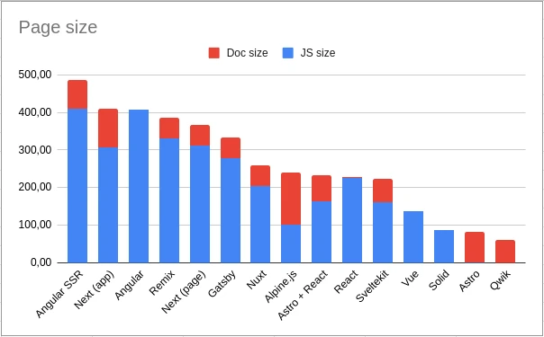
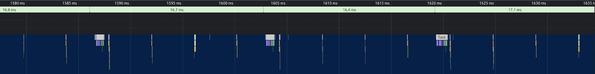
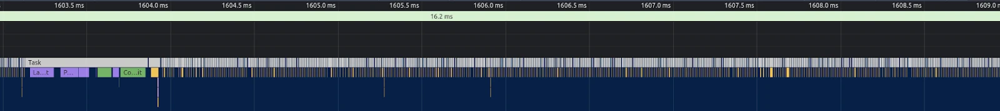

<head>
  <link rel="canonical" href="https://smile.eu/en/publications-and-events/what-frontend-framework-fastest" />
</head>

This article is the third installment in a series, which you can access through the following links:

1.  [How to choose the right front-end architecture?](/blog/posts/front-end-architecture)
2.  [What frontend framework should you choose?](/blog/posts/front-end-frameworks)

So, if you're planning to determine the best front-end framework for your requirements, I recommend reading the preceding articles as well.

<!--truncate-->

In this article, our primary focus will be on comparing the performance of the following frameworks:

- Client Side Rendering (CSR):
  - Angular
  - Angular zoneless (<ins>Added on 1st July 2024</ins>)
  - Preact (<ins>Added on 1st July 2024</ins>)
  - React
  - Solid
  - Vue
- Server Side Rendering (SSR):
  - Alpine (<ins>Added on 1st July 2024</ins>)
  - Angular SSR (<ins>Added on 1st July 2024</ins>)
  - Astro
  - Astro + React
  - Gatsby
  - Next (app router)
  - Next (page router)
  - Nuxt
  - Qwik
  - Remix
  - Sveltekit

Throughout the article, we will cover the following topics:

- Benchmarking the page load times of identical pages implemented in various frameworks.
- Evaluating the reactivity performance of these frameworks.
- Providing a summary and drawing conclusions regarding the fastest frameworks.

## Introduction

This benchmark focuses on the initial page load speed. When I say "first load," I mean that most frontend frameworks implement frontend routing, which has the advantage of not requiring the download of all assets from the beginning.

However, from a Google ranking perspective, the Lighthouse score is crucial. Thus, making efforts to enhance your Lighthouse score can lead to better conversion rates and improved SEO (Search Engine Optimization).

For the tests, I recreated the old [https://www.smile.eu/fr](https://www.smile.eu/fr) homepage (that has been now rebranded), as I wanted to use a page with existing content. The current Lighthouse score of that page is far from perfect, which aligns with the purpose of this comparison.

The main objective here is to compare the different frameworks and see if one outperforms the others.

You can access all the code in [this repository](https://github.com/Smile-SA/frontend-frameworks-comparison).

Now, let's delve into the results of each scenario, utilizing the most optimal approach to serve the content for a fair comparison.

## Glossary

- **FCP**: First Contentful Paint - First Contentful Paint marks the time when the first text or image is painted.
- **LCP**: Largest Contentful Paint - Largest Contentful Paint marks the time when the largest text or image is painted.
- **TBT**: Total Blocking Time - The sum of all time periods between FCP and Time to Interactive, when a task length exceeds 50ms, expressed in milliseconds.
- **CLS**: Cumulative Layout Shift - Cumulative Layout Shift measures the movement of visible elements within the viewport.
- **SI**: Speed Index - Speed Index shows how quickly the contents of a page are visibly populated.

## Lighthouse benchmark

### Full static page

The page has no interaction at all, it's only HTML, CSS, fonts, images...Etc.

Results (with Chrome 125.0.6422.76):

| Frameworks         | Type | Score |
| ------------------ | ---- | ----- |
| Alpine             | SSR  | 83    |
| Angular            | CSR  | 80    |
| Angular SSR        | SSR  | 82    |
| Astro              | SSR  | 81    |
| Astro + React      | SSR  | 82    |
| Gatsby             | SSR  | 81    |
| Next (app router)  | SSR  | 81    |
| Next (page router) | SSR  | 81    |
| Nuxt               | SSR  | 80    |
| Preact             | CSR  | 81    |
| Qwik               | SSR  | 82    |
| React              | CSR  | 82    |
| Remix              | SSR  | 82    |
| Solid              | CSR  | 82    |
| Sveltekit          | SSR  | 82    |
| Vue                | CSR  | 81    |

We can observe that the Lighthouse scores range from 80 to 83, indicating that they are all quite close in value. The Lighthouse score can sometimes exhibit slight variations in multiple test batches, making it challenging to definitively declare one framework as superior to another.

Now, let's shift our focus to the page size. In all these frameworks, the CSS, image, and font sizes remain consistent, differing only in terms of document and JavaScript sizes.

Here is a chart illustrating these differences (sorted by total size):

Here are some notable points to consider:

- The document size of CSR (Client Side Rendering) frameworks (Angular, React, Solid, and Vue) is minimal, at only around 1kB, because it's mostly empty due to the content being generated on the client side.
- Certain frameworks, such as Astro, Qwik, Remix, and Sveltekit, do not include any JS files.
- The JS size appears to be 0 for some cases, but in reality, there is still some JavaScript embedded in the document. This is why the document size varies among SSR (Server Side Rendering) frameworks.

With these observations in mind, we are ready to delve deeper into our analysis.

### Page with little interactions

In this particular scenario, I introduced some JavaScript interactions exclusively in the header and the footer of the page.

Results (with Chrome 125.0.6422.76):

| Frameworks         | Type | Score |
| ------------------ | ---- | ----- |
| Alpine             | SSR  | 82    |
| Angular            | CSR  | 80    |
| Angular SSR        | SSR  | 82    |
| Astro              | SSR  | 82    |
| Astro + React      | SSR  | 80    |
| Gatsby             | SSR  | 82    |
| Next (app router)  | SSR  | 81    |
| Next (page router) | SSR  | 81    |
| Nuxt               | SSR  | 80    |
| Preact             | CSR  | 82    |
| Qwik               | SSR  | 83    |
| React              | CSR  | 82    |
| Remix              | SSR  | 81    |
| Solid              | CSR  | 81    |
| Sveltekit          | SSR  | 82    |
| Vue                | CSR  | 80    |

Like in the previous scenario, the Lighthouse scores range from 80 to 83 with no real differences.

Is it the same for the document and JavaScript sizes? Here is again a new chart illustrating these differences:

Here are some noteworthy observations:

- The document size of CSR (Client Side Rendering) frameworks remains the same as in the previous scenario, and this pattern will persist in all upcoming scenarios.
- Qwik continues to be the only framework that ships zero JS files, a characteristic that will also persist in all future scenarios. This is the result of their unique approach to hydration, where the necessary JS is loaded on demand as users interact with the page (for more details, you can refer to the [previous article](/blog/posts/front-end-architecture) or [their websites](https://qwik.builder.io/)).
- Astro (without React) remains light since it doesn't ship any framework (only 2kB of JS).

The reason for the scores potentially not showing significant differences might be the relatively low number of interactions on the page. To address this, more interactions will be added in the next scenario.

### Page with more interactions

In this scenario, every part of the page has become interactive, and a Leaflet map is loaded in the middle of the page. It's important to note that the data for the map is not fetched but is instead statically stored within the JavaScript.

Results (with Chrome 125.0.6422.76):

| Frameworks         | Type | Score |
| ------------------ | ---- | ----- |
| Alpine             | SSR  | 80    |
| Angular            | CSR  | 80    |
| Angular SSR        | SSR  | 81    |
| Astro              | SSR  | 81    |
| Astro + React      | SSR  | 81    |
| Gatsby             | SSR  | 82    |
| Next (app router)  | SSR  | 81    |
| Next (page router) | SSR  | 80    |
| Nuxt               | SSR  | 82    |
| Preact             | CSR  | 81    |
| Qwik               | SSR  | 83    |
| React              | CSR  | 82    |
| Remix              | SSR  | 80    |
| Solid              | CSR  | 80    |
| Sveltekit          | SSR  | 82    |
| Vue                | CSR  | 80    |

In this scenario, the Lighthouse scores have maybe slightly decreased overall, but still no real differences.

To potentially witness a more substantial difference between the frameworks, we may need to introduce data fetching from a backend. This is the aim of the upcoming scenario.

### Page with interactions and data fetching

In this scenario, I've built upon the previous one by incorporating five API calls to fetch data:

- Four API calls are utilized to load data for the content, with the data fetched on the server for SSR frameworks and on the client for CSR frameworks.
- One API call is dedicated to loading the data for the map, and this call is always executed on the client side.
- To mimic a slower API response, I've introduced a 1-second delay for each API call.
- The four API calls for content are independent of one another, enabling them to be fetched in parallel.
- Whenever possible, I tested both SSR and SSG rendering techniques for SSR frameworks.

Results (with Chrome 125.0.6422.76):

| Frameworks         | Type  | Score |
| ------------------ | ----- | ----- |
| Alpine             | SSR   | 83    |
| Angular            | CSR   | 80    |
| Angular SSR        | SSR   | 81    |
| Astro              | _SSG_ | 80    |
| Astro + React      | _SSG_ | 82    |
| Gatsby             | SSR   | 81    |
| Gatsby             | _SSG_ | 82    |
| Next (app router)  | SSR   | 82    |
| Next (app router)  | _SSG_ | 82    |
| Next (page router) | SSR   | 80    |
| Next (page router) | _SSG_ | 82    |
| Nuxt               | _SSG_ | 81    |
| Preact             | CSR   | 81    |
| Qwik               | _SSG_ | 83    |
| React              | CSR   | 81    |
| Remix              | SSR   | 79    |
| Solid              | CSR   | 81    |
| Sveltekit          | _SSG_ | 82    |
| Vue                | CSR   | 80    |

In the latest scenario, despite the introduction of loading, the Lighthouse scores still haven't notably decreased compared to the previous scenario. This observation holds true for both CSR, where data fetching occurs on the client, and SSR, where data fetching is done on the server, even when the API responses are delayed by 1 second (resulting in a longer perceived loading time for users).

This leads to an important conclusion: Lighthouse scores primarily focus on frontend performance and are less dependent on the efficiency of your APIs.

In the upcoming scenario, I've decided to introduce a significant computational task in the JavaScript to hopefully yield more discernible differences in performance.

### Page with long calculation

In the latest scenario, a lengthy computation task has been added, which involves a very long loop that takes approximately 10 seconds to complete on my computer.

This extended processing time will likely reveal substantial differences in performance.

It's essential to note that this computation is executed on the client for CSR frameworks and on the server for SSR frameworks (without hydration when possible).

Results (with Chrome 125.0.6422.76):

| Frameworks         | Type  | Score  |
| ------------------ | ----- | ------ |
| Alpine             | SSR   | **56** |
| Angular            | CSR   | **27** |
| Angular SSR        | SSR   | **41** |
| Astro              | _SSG_ | 80     |
| Astro + React      | _SSG_ | 81     |
| Gatsby             | SSR   | **72** |
| Next (app router)  | SSR   | **73** |
| Next (page router) | SSR   | **71** |
| Nuxt               | _SSG_ | 82     |
| Preact             | CSR   | **41** |
| Qwik               | _SSG_ | 83     |
| React              | CSR   | **42** |
| Remix              | SSR   | **69** |
| Solid              | CSR   | **27** |
| Sveltekit          | _SSG_ | **44** |
| Vue                | CSR   | **27** |

In this scenario, we indeed begin to witness significant differences:

- CSR frameworks exhibit lower scores, ranging from 27 to 42, with variations across different test batches, underscoring tangible distinctions between these frameworks.
- In SSR cases, there's about a 10-point drop in scores due to an increase in the SI metric. This suggests that a prolonged TTFB (Time To First Byte) can have a minor impact on the Lighthouse score compared to the time spent on the client side.
- SSG frameworks, apart from Sveltekit, do not experience any significant impact from the calculation since it's performed during the build process. However, Sveltekit's score is similar to CSR frameworks, as it primarily does the long calculation on the client side.
- Remix cannot perform SSG, but Gatsby and Next can, which means that in some instances, these frameworks can transition to SSG to mitigate the impact of the lengthy calculation (which will then be done at build time).

This example effectively demonstrates that having a long calculation on the server is generally more favorable than having this calculation in the client. However, in most real-life projects, such an exact scenario may not occur. The most common scenario where time is consumed by JavaScript is during the rendering of your components. Let's proceed to the next scenario.

### Page with long hydration

In this scenario, the objective is to have the time consumed during the rendering process, which primarily affects SSR frameworks. In most of these frameworks, rendering takes place on the server side. However, during page load, the rendering occurs again on the client side, a process known as hydration.

This scenario aims to illustrate the impact of rendering time on the performance of SSR frameworks when hydration is involved.

SSR framework results (with Chrome 125.0.6422.76):

| Frameworks                             | Type  | Score  |
| -------------------------------------- | ----- | ------ |
| Alpine (same as previous)              | SSR   | 56     |
| Angular SSR (same as previous)         | SSR   | 41     |
| Astro (same as previous)               | _SSG_ | **80** |
| Astro + React (using `client:load`)    | _SSG_ | 40     |
| Astro + React (using `client:visible`) | _SSG_ | **82** |
| Gatsby                                 | SSR   | 42     |
| Next (app router, same as previous)    | SSR   | **73** |
| Next (page router)                     | SSR   | 41     |
| Nuxt                                   | _SSG_ | 46     |
| Qwik                                   | _SSG_ | **83** |
| Remix                                  | SSR   | 41     |
| Sveltekit                              | _SSG_ | 43     |

In this scenario, several important observations can be made:

- The impact of hydration is evident and significantly reduces the scores for both SSR and SSG rendering techniques to a level similar to that of CSR frameworks. This is because the lengthy calculation occurs solely on the client for SSG, while for SSR, it happens on both the server and the client.
- Astro without React uses plain JS, avoiding the need for hydration, resulting in no significant impact on the Lighthouse score. it does not mean that Astro can magically avoid any long calculation. If you have a long calculation that happen on the client part, it will affect the score like any other CSR frameworks, but if you have done the calculation on the server, there will be no hydration, thus this calculation will only happen on the server.
- The `client:visible` directive in Astro can be used to lazily load framework components. This means that the long calculation only occurs when the component enters the viewport, having no detrimental effect on the Lighthouse score (in this case).
- In the case of Next (using the app router), the lengthy calculation is placed inside a React server component, which is not hydrated. As a result, the calculation takes place exclusively on the server side, minimizing the impact of component hydration.
- Qwik's "resumability" technique ensures that no calculation occurs on the client side because it has already been executed on the server, further optimizing performance.

These findings shed light on the different approaches and their implications for frontend framework performance under varying circumstances.

## Reactivity benchmark

### Goal

In this section, our focus will be on benchmarking the reactivity of the framework.

This activity takes place after the page has loaded, for instance, when a user interacts with the page by clicking a button to display something. Our aim is to prevent lengthy tasks, those that take more than 50 milliseconds, in order to ensure the page feels smooth.

The objective of this benchmark is to gauge the framework's performance in handling this task, specifically how much time it takes for the framework to update the DOM in response to a state change.

One way to assess this cost is by calculating the time the framework requires for a simple task, such as incrementing a counter. In this case, the majority of the time spent on this action is, in fact, the time taken by the framework to re-render and update the DOM, while the cost of the custom code part (the increment operation) is negligible.

However, measuring and comparing this can be challenging because this action is very quick. A simpler way to make comparisons is to count the number of times a framework can render within one second.

### Technical implementation

The challenging aspect here is updating the application state and allowing the framework to perform rendering, and then triggering a new state update when the rendering is completed, and so on. Due to the single-threaded nature of JavaScript, it's not possible to update the state within a loop. In such a scenario, the framework will likely render only when the loop is finished, updating the DOM with the final version of the counter. This isn't what we want because we want to count the number of renders.

Our goal is to effectively see the counter increase, as shown in this animation:

<video className="video" controls>
  <source src="/blog/video/counter.webm" type="video/webm" />
</video>

We also want to use the same technique for all frameworks to ensure a fair comparison. For example, it's not possible to use React's useEffect to trigger a new increment after rendering is complete.

One way to accomplish this is by using something like `setTimeout(increment, 0)`. Calling setTimeout postpones the execution of the increment function until the main thread is available. However, the problem with setTimeout is that it's not quick enough; it takes about 4 milliseconds to trigger a new increment.

You can see this in the Google Devtools Performance tab record:

What we would like is something similar to the node setImmediate function. We can achieve a similar effect using MessageChannel. Here is the performance tab record demonstrating all the updates:

With this solution, we are now prepared to compare the reactivity of different frameworks.

### Results

I didn't implement the reactivity benchmark for all frameworks because Next, Gatsby, Remix, and others all rely on React. I only implemented it when the frontend framework was something other than React.

So, here's the ranking of how many renders these frameworks can perform in one second, from best to worst:

| Framework            |  Render |
| -------------------- | ------: |
| Native JS (Astro)    | ~206200 |
| Solid                | ~186500 |
| Svelte               | ~152200 |
| Qwik                 |  ~92500 |
| Vue                  |  ~61700 |
| Alpine.js            |  ~60600 |
| Angular with signals |  ~48900 |
| React optimized      |  ~31200 |
| React non optimized  |   ~2500 |
| Preact               |   ~1800 |
| Angular              |   ~1100 |

Let's calculate some score based on the maximum score:

| Framework            | Score |
| -------------------- | ----: |
| Native JS (Astro)    |  100% |
| Solid                | 90.4% |
| Svelte               | 73.8% |
| Qwik                 | 44.9% |
| Vue                  | 29.9% |
| Alpine.js            | 29.4% |
| Angular with signals | 23.7% |
| React optimized      | 15.1% |
| React non optimized  |  1.2% |
| Preact               |  0.9% |
| Angular              |  0.5% |

Here are some noteworthy points:

- It's quite reassuring to see that native JavaScript implementation is the top performer.
- The Solid reactivity system is designed with a focus on speed (you can learn more about it here: https://www.solidjs.com/guides/reactivity)
- Svelte, while not exactly a framework, compiles to native JavaScript in an efficient manner.
- React's performance can vary significantly, from being the worst-performing framework to being more than 10 times better, depending on how you define the state in your application.
- Angular's results are subpar due to the necessity of reintegrating messages from the MessageChannel into the Angular flow using NgZone, but the new signal-based reactivity system performs well.

You can also refer to [this benchmark page](https://krausest.github.io/js-framework-benchmark/current.html), which compares various frameworks in different scenarios, but the overall conclusions remain consistent.

## Summary

### Global

Here are some general points to consider before delving into the conclusions for each framework:

- Lighthouse primarily records frontend performance, and backend requests have a minimal impact on the score.
- This implies that you must focus on optimizing your frontend if you want to improve the lighthouse score.
- But having a page that takes a long time to be served by a backend is also a bad experience for your user. You may need to use other tools than lighthouse to record and report and then ensure that your server is fast to provides the best user experience.
- Overall, SSR (Server-Side Rendering) frameworks perform slightly better than CSR (Client-Side Rendering) frameworks, although the difference is not substantial (depending on how much calculation you can so on the backend side).
- This suggests that CSR frameworks are still viable options when building applications like Back-Office systems, intranets, extranets, connected apps, and so on (but do not use CSR frameworks if SEO is a concern).
- While there are no significant variations among CSR frameworks in the page load benchmark, there are notable differences in terms of reactivity.

### Qwik

Taking the results into account, the Qwik framework appears to be performing exceptionally well, especially when you aggregate all the Lighthouse scenario scores in one place:

| Scenario                                 | Qwik |
| ---------------------------------------- | ---- |
| Full static page                         | 82   |
| Page with little interactions            | 83   |
| Page with interactions                   | 83   |
| Page with interactions and data fetching | 83   |
| Page with long calculation               | 83   |
| Page with long hydration                 | 83   |

The framework's ability to compensate for suboptimal programming is quite impressive.

Although the framework's reactivity system is one of the fastest (scoring 44.9%).

### Astro

Astro is also notable because of its island architecture, which allows you to choose the framework you want for specific components where it's most advantageous.

Thanks to Astro directives, such as `client:visible`, you can load framework parts only when they are required.

Here are the consolidated results for Astro with React when utilizing this directive:

| Scenario                                 | Astro |
| ---------------------------------------- | ----- |
| Full static page                         | 82    |
| Page with little interactions            | 80    |
| Page with interactions                   | 81    |
| Page with interactions and data fetching | 82    |
| Page with long calculation               | 81    |
| Page with long hydration                 | 82    |

The distinction between Astro and Qwik lies in the fact that, for Astro, the extended hydration process will still occur on the frontend when the component enters the viewport.

You may also encounter a challenge when it comes to enabling multiple island components to communicate with each other in Astro. However, this issue can be resolved using tools like Astro nano stores or a state library such as Redux, among others.

It's important to note that the reactivity of the framework will depend on the specific framework you choose in combination with Astro.

### Next / Gatsy / Remix / Nuxt

Here's a summary of the scores for Next, Gatsby, Remix, and Nuxt:

| Scenario                                 | Next (app routing)  | Next (page routing) | Gatsby              | Remix    | Nuxt     |
| ---------------------------------------- | ------------------- | ------------------- | ------------------- | -------- | -------- |
| Full static page                         | 81                  | 81                  | 81                  | 82       | 80       |
| Page with little interactions            | 81                  | 81                  | 82                  | 81       | 80       |
| Page with interactions                   | 81                  | 80                  | 82                  | 80       | 82       |
| Page with interactions and data fetching | 82 (ssr) / 82 (ssg) | 80 (ssr) / 82 (ssg) | 81 (ssr) / 82 (ssg) | 79 (ssr) | 81 (ssg) |
| Page with long calculation               | 73 (ssr)            | 71 (ssr)            | 72 (ssr)            | 69 (ssr) | 82 (ssg) |
| Page with long hydration                 | 73                  | 41                  | 42                  | 41       | 46       |

Based on these results, we can conclude that in most scenarios, these frameworks exhibit similar performance levels.

Next stands out when it uses app routing (and, consequently, React Server Component) and performs better in situations where a server component needs to perform complex calculations. However, in practice, such cases might not be very common because these calculations often rely on frontend state and need to be recalculated on the client side.

Nonetheless, if you encounter performance issues, utilizing Next with React Server Side Rendering could be a favorable choice. It not only has the potential to improve performance in specific scenarios but also reduces the overall number of hydrated components. Therefore, if you're looking to employ React with Server Side Rendering, Next is likely one of the top choices.

### SvelteKit / Angular SSR

Lighthouse Score results for SvelteKit and Angular SSR:

| Scenario                                 | SvelteKit | Angular SSR |
| ---------------------------------------- | --------- | ----------- |
| Full static page                         | 82        | 82          |
| Page with little interactions            | 82        | 82          |
| Page with interactions                   | 82        | 81          |
| Page with interactions and data fetching | 82        | 81          |
| Page with long calculation               | 44 (ssg)  | 41          |
| Page with long hydration                 | 46        | 41          |

I was somewhat taken aback by the outcomes. In general, they are slightly inferior to those of other frameworks, because they aren't capable of serializing extensive calculations typically reserved for the backend. While this may not occur often, the option remains unavailable.

However, the SvelteKit's reactivity system is highly effective, scoring 73.8%.

For Angular you might want to choose to use Signals if you want to build your app for speed (scoring 23.7% with signals versus 0.5% without them).

In that case, it is quite comparable to the frameworks mentioned above.

### Alpine.js

Lighthouse Score results for Alpine.js:

| Scenario                                 | Alpine.js |
| ---------------------------------------- | --------- |
| Full static page                         | 80        |
| Page with little interactions            | 80        |
| Page with interactions                   | 80        |
| Page with interactions and data fetching | 80        |
| Page with long calculation               | 27        |

It appears that Alpine.js scores slightly above other frameworks, though the performance is still quite similar overall.

Alpine.js remains a great solution, especially if your pages are generated by another backend tool (such as a PHP CMS) and you don't want to use a headless solution.

Additionally, the framework has a solid reactivity score of 29.4%.

### React / Vue / Angular / Solid / Preact

Here's a summary of the scores for these frameworks:

| Scenario                                 | Angular | Preact | React | Solid | Vue |
| ---------------------------------------- | ------- | ------ | ----- | ----- | --- |
| Full static page                         | 80      | 81     | 82    | 82    | 81  |
| Page with little interactions            | 80      | 82     | 82    | 81    | 80  |
| Page with interactions                   | 80      | 81     | 82    | 80    | 80  |
| Page with interactions and data fetching | 80      | 81     | 81    | 81    | 80  |
| Page with long calculation               | 27      | 41     | 42    | 27    | 27  |

It's difficult to identify any significant differences here; the results are quite consistent.

The only notable exception is that Solid boasts the fastest reactive system, earning a score of 90.4% and establishing itself as the top reactive CRS framework.

## Conclusion

In conclusion, there are relatively few differences, making the choice of framework less critical for performance.

Furthermore, if you encounter performance issues, you're likely to find solutions within the framework you're using.

Nonetheless, here are the final results:

- **Qwik** stands out with its impressive resumable hydration system, as it appears to be optimized by default. This could be an excellent choice for projects that require building everything from scratch and don't heavily rely on external libraries. It's worth noting that the Qwik ecosystem and community are relatively new.
- **Astro** offers strong performance and allows you to select your preferred framework. However, its island architecture might not be suitable for all projects. Consider using it if you only need interactivity in specific parts of your website.
- **Next** would likely be the default choice for projects that don't fall into the aforementioned categories.
- **Solid** boasts the best reactivity, but like Qwik, its ecosystem is still emerging. It might be worth exploring in scenarios where SEO isn't a primary concern (though SolidStart offers SSR, it's still in beta) and where you don't heavily rely on external libraries.
