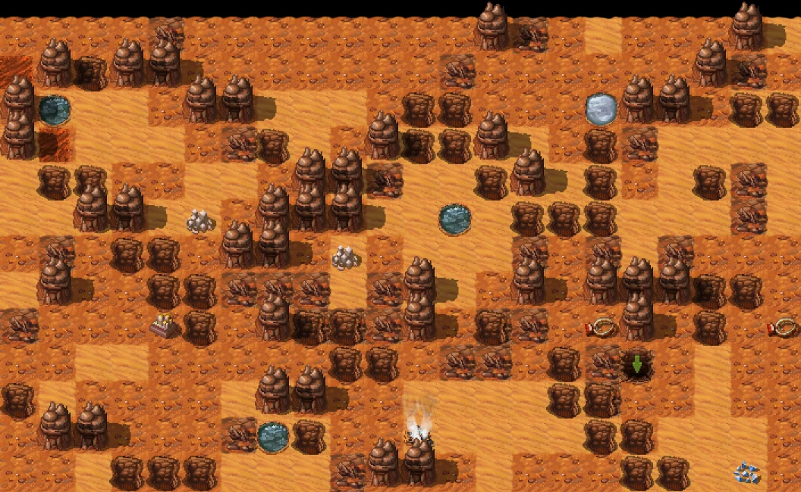
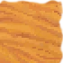
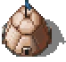
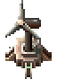
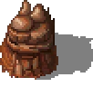

This is the first article in a series on how I rebuilt a game (the [Farlanders](https://store.steampowered.com/app/1318740/Farlanders/) game) using web technologies and React.

For those unfamiliar with the Farlanders game, it is a top-down, turn-based strategy game about creating a colony on Mars, developed by [Andriy Bychkovskyi](https://bychkovskyi.com/) and published by [Crytivo](https://crytivo.com/).

I played it with great enjoyment and realized it was the kind of game that could work well with browser technologies and a frontend framework like React.

<!--truncate-->

My intent with rebuilding the game is purely educational, and my version will never be as polished and complete as the original.

You can find the code for my version [here](https://github.com/tonai/react-farlanders) and you can try the current state of the game [here](https://tonai.github.io/react-farlanders/).

In this first part, we will see how to display the board as shown in the following image and manage the camera controls:



## Board

### Data model

Farlanders is like a board game with a 2D grid where objects can only be placed in the board cells.

When you start a game, you are given a generated raw map on which you can place buildings.  
In some cases, multiple objects can be stacked.  
Therefore, I decided to use the following Typescript interfaces to describe the map:

```ts
// Identifier or array of ids when you have multiple buildings stacked
export type ISid = number[] | number;
// A cell is composed of land, landform, optional buildings...
export interface ICell {
  buildings?: ISid; // Represents house, greenhouse, water pump...
  land: ISid; // Represents sand, ground or wasteland
  landform: ISid; // Represents canyon, mountain, mineral deposit...
  power?: number; // Type of power conduit if there is some.
  tunnel?: number; // Type of tunnel if there is some.
  water?: number; // Type of water pipe if there is some.
}
// A board is a 2 dimension array of cells
export type IBoard = ICell[][];
// The final map is composed of multiple boards (ground and undergrounds)
export type IMap = Record<number | string, IBoard>;
```

With this model a newly generated map can be represented like this:

```json
{
  // level 0: ground
  "0": [
    // First row
    [
      { "land": 2, "landform": 16 },
      { "land": 1, "landform": 20 },
      { "land": 1, "landform": 0 },
      { "land": 1, "landform": 0 },
      { "land": 2, "landform": 0 },
      { "land": 2, "landform": 16 },
      { "land": 2, "landform": 16 }
      // ... Other row cells
    ]
    // ... Other rows
  ]
  // ... Underground levels
}
```

This approach allows me to store the starting map quite efficiently. For now, I use a test map and will work on the map generator later.

When the map is loaded, I iterate through all the cells and convert the number identifiers into block objects.  
Each block type is assigned a number and a string identifier for better human readability.  
Here are some block examples:

```json
[
  {
    "id": "sand",
    "images": "assets/natural/land/sand1.png",
    "sid": 1
  },
  // ...
  {
    "id": "wasteland",
    "images": "assets/natural/land/wasteland1.png",
    "sid": 3
  },
  // ...
  {
    "id": "canyon",
    "images": "assets/natural/landform/canyon1.png",
    "sid": 10
  }
  // ...
]
```

**Note:** There is only one image per block here, but I named the property `images` to allow for the possibility of adding multiple images later and randomly choosing one to display.

Here are the types of the final transformed board:

```ts
// Cell is now composed of blocks instead of only numbers
export interface ICellBlock
  extends Omit<ICell, "buildings" | "land" | "landform" | "tunnel"> {
  buildings?: IBlock | IBlock[] | undefined;
  land: IBlock | IBlock[] | undefined;
  landform: IBlock | IBlock[] | undefined;
  tunnel?: IBlock;
}
// The board
export type IBoardBlock = ICellBlock[][];
// The full map
export type IMapBlock = Record<number | string, IBoardBlock>;
```

### Loading

To display the images correctly on the board, I need to load them and measure their dimensions.

Here are some image examples with their dimensions:

<div className="center">

|            Sand             |               Basic house                |                Wind turbine                |              Mountain               |
| :-------------------------: | :--------------------------------------: | :----------------------------------------: | :---------------------------------: |
|  |  |  |  |
|            70x70            |                  74x70                   |                   64x88                    |               102x96                |

</div>

To achieve this, I created a `GameLoader` component that is responsible for generating an `imageMap` object, which I can then use to retrieve the image information:

```tsx
function loadImage(block: IBlock): Promise<IImage> {
  return new Promise((resolve, reject) => {
    const image = new Image() as IImage;
    image.onload = () => resolve(image);
    image.onerror = () => reject(image);
    image.src = block.images;
    image.block = block;
  });
}

function GameLoader(): ReactElement | null {
  const [imageMap, setImageMap] = useState(new Map());

  useEffect(() => {
    Promise.all(blocks.map(loadImage)).then((images) => {
      setImageMap(new Map(images.map((image) => [image.block.sid, image])));
    });
  }, []);

  if (imageMap.size === 0) {
    return null;
  }

  return <Game imageMap={imageMap} />;
}
```

### Drawing

To draw the board, we could display one `<div>` element for each cell, but to reduce the number of DOM elements, I decided to draw everything within a single `<div>` element using multiple backgrounds.

When you look at the final result, you’ll see that the top line should be under the line directly below it (so the mountains of the line below should be entirely visible). Additionally, each block can cast a shadow to the right, so the right block must be under the left block.

When using the CSS `background` property, the first image in the list will be on top of the others. Therefore, we need to create the `background` property starting from the bottom left and draw row by row. Also, buildings and landforms must be drawn on top of the flat land.

So, the final background will be a concatenation of the buildings, landforms, etc., followed by the lands:

```ts
// Buildings, landforms and tunnels
const buildingsBg = getBackgroundArray(imageMap, mapLevel, [
  DrawableCellType.Buildings,
  DrawableCellType.Tunnel,
  DrawableCellType.Landform,
]);
// Only lands
const landBg = getBackgroundArray(imageMap, mapLevel);
// Final background property
const background = [...buildingsBg, ...landBg].join(",");
```

The `getBackgroundArray` function iterates over the board in the correct order and uses the following function to get the `background` string for a block at the right position (`i` and `j` are the iteration indices of the board):

```ts
const BLOCK_SIZE = 64;

// Return a block background string
function getBlockBackground(
  imageMap: Map<number, IImage>,
  i: number,
  j: number,
  block?: IBlock,
): string | null {
  if (!block) {
    return null;
  }
  const image = imageMap.get(block.sid);
  if (!image) {
    return null;
  }
  return `${j * BLOCK_SIZE}px ${
    (i + 2) * BLOCK_SIZE - image.height
  }px no-repeat url(${block.images})`;
}
```

## Camera

### Panning

I want to be able to pan the board with the mouse to quickly display the portion of the board I want.

To ensure smooth panning, I won't use React state for this. Instead, I'll get the ref of the board container and handle all the logic inside a custom hook.

Here is the `CameraControls` component that wraps the `Board` component:

```tsx
function CameraControls(props: IBoardProps): ReactElement {
  const rootEl = useRef<HTMLDivElement>(null);
  const boardEl = useRef<HTMLDivElement>(null);
  const boardCameraProps = useCameraDrag(rootEl, boardEl);

  // Center camera
  useEffect(() => {
    if (rootEl.current) {
      const { height, width } = rootEl.current.getBoundingClientRect();
      rootEl.current.scrollLeft = (rootEl.current.scrollWidth - width) / 2;
      rootEl.current.scrollTop = (rootEl.current.scrollHeight - height) / 2;
    }
  }, []);

  return (
    <div className="CameraControls">
      <div ref={rootEl} className="CameraControls__scroll">
        <div
          className="CameraControls__area"
          {...boardCameraProps}
          ref={boardEl}
        >
          <Board {...props} />
        </div>
      </div>
    </div>
  );
}
```

And in the `useCameraDrag` I use mouse and touch events to update the `scrollLeft` and `scrollTop` values:

```ts
export function useCameraDrag(
  rootEl: RefObject<HTMLDivElement>,
  boardEl: RefObject<HTMLDivElement>,
) {
  const dragPoint = useRef<IPoint>();

  function handleMove(event: MouseEvent): void {
    if (rootEl.current && dragPoint.current) {
      const point = { x: event.clientX, y: event.clientY };
      rootEl.current.scrollLeft += dragPoint.current.x - point.x;
      rootEl.current.scrollTop += dragPoint.current.y - point.y;
      dragPoint.current = point;
    }
  }

  function handleMouseDown(event: ReactMouseEvent<HTMLDivElement>): void {
    if (boardEl.current && event.button === 0 && !dragPoint.current) {
      dragPoint.current = {
        x: event.clientX,
        y: event.clientY,
      };
      boardEl.current.addEventListener("mousemove", handleMove);
    }
  }

  function handleMouseUp(): void {
    if (boardEl.current) {
      dragPoint.current = undefined;
      boardEl.current.removeEventListener("mousemove", handleMove);
    }
  }

  return {
    onMouseDown: handleMouseDown,
    onMouseUp: handleMouseUp,
  };
}
```

Here is the result:

<video className="video" controls>
  <source src="/blog/video/panning.webm" type="video/webm" />
</video>

### Zooming

I also want the player to be able to zoom in and out of the board.

To achieve this, I added a new `zoom` ref and a `useCameraWheel` custom hook in the `CameraControls` component:

```tsx
function CameraControls(props: IBoardProps): JSX.Element {
  const rootEl = useRef<HTMLDivElement>(null);
  const boardEl = useRef<HTMLDivElement>(null);
  const zoom = useRef(DEFAULT_ZOOM); // 0.75
  useCameraWheel(rootEl, boardEl, zoom);
  const boardCameraProps = useCameraDrag(rootEl, boardEl);
  // ... Same as previous
}
```

The `useCameraWheel` captures the mouse wheel event to update the zoom ref and adjusts the `scale` and scroll position based on the mouse position (we want the zoom to occur at the player's current mouse position):

```ts
export const ZOOMS = [0.5, 0.75, 1, 1.5, 2];
export const MIN_ZOOM = 0;
export const MAX_ZOOM = ZOOMS.length - 1;

export function zoomCamera(
  rootEl: RefObject<HTMLDivElement>,
  boardEl: RefObject<HTMLDivElement>,
  prevZoom: number,
  nextZoom: number,
  x: number,
  y: number,
): void {
  if (rootEl.current && boardEl.current && prevZoom !== nextZoom) {
    const { scrollLeft, scrollTop } = rootEl.current;
    boardEl.current.style.transform = `scale(${nextZoom})`;
    const factor = nextZoom / prevZoom;
    rootEl.current.scrollLeft = (x + scrollLeft) * factor - x;
    rootEl.current.scrollTop = (y + scrollTop) * factor - y;
  }
}

export function useCameraWheel(
  rootEl: RefObject<HTMLDivElement>,
  boardEl: RefObject<HTMLDivElement>,
  zoom: MutableRefObject<number>,
): void {
  useEffect(() => {
    function handleWheel(event: WheelEvent): void {
      if (boardEl.current && rootEl.current) {
        const prevZoom = ZOOMS[zoom.current];
        if (event.deltaY > 0) {
          if (zoom.current > MIN_ZOOM) {
            zoom.current--;
          }
        } else if (zoom.current < MAX_ZOOM) {
          zoom.current++;
        }
        const nextZoom = ZOOMS[zoom.current];
        zoomCamera(
          rootEl,
          boardEl,
          prevZoom,
          nextZoom,
          event.clientX,
          event.clientY,
        );
      }
    }

    window.addEventListener("wheel", handleWheel);
    return () => window.removeEventListener("wheel", handleWheel);
  }, [boardEl, rootEl, zoom]);
}
```

Here is the result:

<video className="video" controls>
  <source src="/blog/video/zooming.webm" type="video/webm" />
</video>

### Edge scrolling

I also added transparent `<div>` elements in the `CameraControls` component, positioned at the edges of the screen to automatically move the board when the player's mouse enters those areas:

```tsx
function CameraControls(props: IBoardProps): JSX.Element {
  // ... Same as previous
  const { handleMouseEnter, handleMouseLeave } = useCameraMove(rootEl);
  return (
    <div className="CameraControls">
      <!-- ... Previous HTML code -->
      <!-- Top edge -->
      <div
        className="CameraControls__top"
        onMouseEnter={() => handleMouseEnter({ [Axis.Y]: -1 })}
        onMouseLeave={handleMouseLeave}
      />
      <!-- ... Others edges -->
      <!-- Top left corner -->
      <div
        className="CameraControls__topLeft"
        onMouseEnter={() => handleMouseEnter({ [Axis.Y]: -1, [Axis.X]: -1 })}
        onMouseLeave={handleMouseLeave}
      />
      <!-- ... Other corners -->
    </div>
  );
}
```

The `useCameraMove` is responsible of animating the scroll using `requestAnimationFrame`:

```ts
export function useCameraMove(rootEl: RefObject<HTMLDivElement>) {
  const animating = useRef(false);
  const camera = useRef<ICameraMoves>({});

  const move = useCallback(() => {
    const entries = Object.entries(camera.current);
    if (entries.length > 0) {
      entries.forEach(([axis, dir]) => {
        if (axis === Axis.X && rootEl.current) {
          rootEl.current.scrollLeft += SCROLL_SPEED * dir;
        } else if (axis === Axis.Y && rootEl.current) {
          rootEl.current.scrollTop += SCROLL_SPEED * dir;
        }
      });
      requestAnimationFrame(move);
    } else {
      animating.current = false;
    }
  }, [rootEl]);

  function handleMouseEnter(cameraMove: ICameraMoves): void {
    camera.current = cameraMove;
    if (!animating.current) {
      animating.current = true;
      requestAnimationFrame(move);
    }
  }

  function handleMouseLeave(): void {
    camera.current = {};
  }

  return { handleMouseEnter, handleMouseLeave };
}
```

Here is the result:

<video className="video" controls>
  <source src="/blog/video/scrolling.webm" type="video/webm" />
</video>

### Keyboard scrolling

Finally, I want the user to be able to move the board using the arrow keys.

This functionality is similar to edge scrolling, so the code is included in the `useCameraMove` hook:

```ts
export function useCameraMove(rootEl: RefObject<HTMLDivElement>) {
  // ... Same as previous
  useEffect(() => {
    function handleKeyDown(event: KeyboardEvent): void {
      if (!event.repeat) {
        switch (event.code) {
          case KEY_UP:
            camera.current[Axis.Y] = -1;
            break;

          case KEY_DOWN:
            camera.current[Axis.Y] = 1;
            break;

          case KEY_LEFT:
            camera.current[Axis.X] = -1;
            break;

          case KEY_RIGHT:
            camera.current[Axis.X] = 1;
            break;
        }
        if (!animating.current) {
          animating.current = true;
          requestAnimationFrame(move);
        }
      }
    }

    function handleKeyUp(event: KeyboardEvent): void {
      switch (event.code) {
        case KEY_UP:
          if (camera.current[Axis.Y] === -1) {
            delete camera.current[Axis.Y];
          }
          break;

        case KEY_DOWN:
          if (camera.current[Axis.Y] === 1) {
            delete camera.current[Axis.Y];
          }
          break;

        case KEY_LEFT:
          if (camera.current[Axis.X] === -1) {
            delete camera.current[Axis.X];
          }
          break;

        case KEY_RIGHT:
          if (camera.current[Axis.X] === 1) {
            delete camera.current[Axis.X];
          }
          break;
      }
    }

    window.addEventListener("keydown", handleKeyDown);
    window.addEventListener("keyup", handleKeyUp);
    return () => {
      window.removeEventListener("keydown", handleKeyDown);
      window.removeEventListener("keyup", handleKeyUp);
    };
  }, [move]);

  return { handleMouseEnter, handleMouseLeave };
}
```

## Conclusion

And that’s it for this first article. We now have a board, and the player can interact with it.

We don’t have a game yet, but we have to start somewhere.

Stay tuned for the next article!
