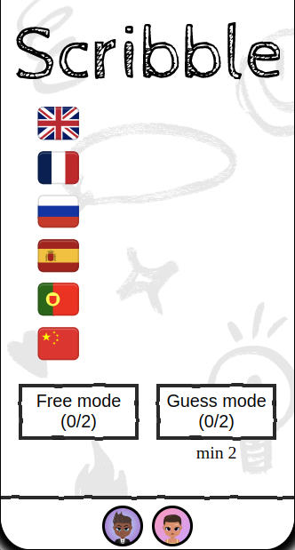
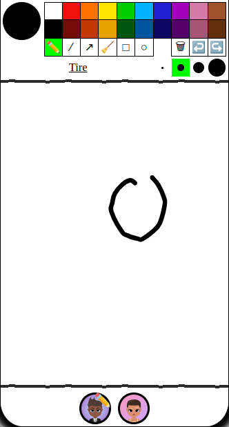
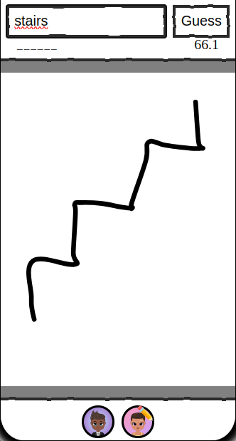

For the [Dusk 1st Jam](https://developers.dusk.gg/blog/dusk-jam), I developed a drawing guess game similar to [skribbl.io](https://skribbl.io/) in the [Dusk platform](https://dusk.gg/). Here is how I did it.

But first why choosing a drawing guess game ?

1. The jam theme was creativity, so letting the player draw freely seems to be matching
2. I thought (hope) this would be something that people will gladly play on Dusk (I saw streamers having fun using [skribbl.io](https://skribbl.io/))
3. I needed to finish the jam earlier because of my wedding party occurring at the same time and I already had some thought on how to implement that idea

Here you can check the final result:

<div class="flex flex-equal mb">
  <div>  </div>
  <div>  </div>
  <div>  </div>
</div>

Or you can directly play it yourself on the [Dusk app](https://join.rune.ai/game/x0lXLIxo-MgE).

And you can have a look at the sources [on Github](https://github.com/tonai/scribble).

## Full dump

To implement the drawing part I decided to use the [drauu](https://github.com/antfu/drauu) open source library.

Drauu is a SVG-based drawing tool for the browser and I know that [Slidev](https://github.com/slidevjs/slidev), which is using that library, successfully implemented shared drawing between multiples clients so I was confident it was the right tool.

Also I already had some experience using that library and I know it had the features I was looking for (And I also didn't had much time to look for another one 😅).

Looking in the Slidev and drauu code bases I found the functions used to dump and restore the drawing. It basically get the SVG content with `innerHTML` on one side and then update the SVG content (again using `innerHTML`) on the other side.

So my first attempt was to basically create a `dump` property inside the game state (that is automatically synchronized between the players by the Dusk platform), and then just send that dump from the drawing player about every 100ms.

Sending data every 100ms is a Dusk limitation but for drawing that's not a problem, you can see what the others are drawing in a fairly fluid way (In fact I use 125ms to be sure to not hit the limitation).

And the first results were good, it was working very well, and you can see live what other players are drawing.

But after more testing I hit another Dusk limitation: the maximum payload size can not exceed 30ko.

It is fine if you draw something simple, but if you add more and more details to your drawing you will end up hitting that limit, which is causing the game to crash.

I can not allow that so I decided to try another strategy.

## Smart diff

To fix that issue I will need to send only a diff of changes.

There is two options:

1. wait for the drawer to end his drawing and then synchronize the newly added drawing
2. or keep the 125ms update loop

The first one is simpler to implement because we don't need to handle updates of drawing.

But we loose the real time drawing update that was quite magic in the first attempt so I decided to try the second solution first.

For that I need to keep track of each drawing items and compare them in the loop, to send only:

1. What has been added
2. What has been updated
3. and what has been removed

This is the simplified version of the `getDiff` function:

```ts
export type AddAction = [Action.ADD, string];
export type DeleteAction = [Action.DELETE];
export type UpdateAction = [Action.UPDATE, string];
export type DiffAction = AddAction | DeleteAction | UpdateAction;

export function getDiff(
  prevNodes: SVGElement[],
  lastNodes: SVGElement[],
  prevDump: string[],
  lastDump: string[],
): DiffAction[] {
  if (lastNodes.length === 0 && prevNodes.length === 0) {
    return [];
  }
  const diff: DiffAction[] = [];
  const all = [...new Set(prevNodes.concat(lastNodes))];
  for (const node of all) {
    const prevIndex = prevNodes.indexOf(node);
    const lastIndex = lastNodes.indexOf(node);
    // Update
    if (prevIndex === lastIndex) {
      if (prevDump[prevIndex] !== lastDump[lastIndex]) {
        diff.push([Action.UPDATE, node.outerHTML]);
      }
      continue;
    }
    // Deleted item
    if (lastIndex === -1) {
      diff.push([Action.DELETE]);
      continue;
    }
    // New item
    if (prevIndex === -1) {
      diff.push([Action.ADD, node.outerHTML]);
      continue;
    }
  }
  return diff;
}
```

Then when the other players receive the diff we need to update the SVG.

For that I use a second hidden SVG where I can use `innerHTML`, without overriding the current drawing, and get the added item I can then move into the real SVG.

## Free drawing mode

I wanted to add another mode to the game to simply allow peoples to draw together on the same canvas (no goal, just drawing).

In my opinion this would reinforce the creativity theme, but I think it could also be nice to have a place where people gather together and just share some drawings (Dusk has a voice chat included).

But this was particularly tricky because I wanted for multiple players to draw things at the same time.

To avoid "collisions" and address that I decided to display the hidden SVG and to render it on top on the first one.

I will use that second SVG to render what other peoples are drawing and only move the drawing to the main SVG when it is done (I still need to move it to the main SVG so the lines are kept in order and you can always draw something on top of it).

I also decided to add data attributes to the SVG items that are drawn to be able to find them and update or remove them when needed:

- A `data-id` attribute containing the player id
- A `data-time` attribute containing the creation time of the item (to serve as identifier)

It was working but there was still some issues to address:

## Working with diff in the state

The game state is not suited to handle diffs, because it is supposed to be the actual representation of the game at some point in time, but when you send a diff it is more like a one time action.

What you should normally do is:

1. Send an action with diff data.
2. Calculate the new state.
3. Then, on the next loop, if there is no actions the state should be the same.

But I decided to put the diff in the game state because it seems more simpler at first sight.

I could probably have done the calculation of the full drawing in the logic but it would have required a more complex shape to handles multiples concurrent drawings (I can't just replace what is in the main SVG because you can be drawing something).

The problem with sending the diff is that:

1. You send an action with diff data.
2. You store that data in the state.
3. You can then update the client based on that data.
4. Then, on the next loop, you still have that diff value inside the state, but you already have processed it. You should only process the diff if it's new.

To address this issue I decided to send a timestamp along the diff action, and when the diff is processed, update the time so the next time you only process an action that is in the future.

One big mistake was to handle this into one variable, but in reality clients can have slightly different timing and if a player's clock is a little behind the others, some of his drawing can be completely skipped causing some desynchronization.

This issue was pretty hard to catch because it did not append in the dev environment.

Finally I used an object to store the last diff time for each player and here is the final draw function:

```ts
export const lastTime = ref<Record<string, number>>({});
// drawDiff contains diffs for each players
export function draw(drawDiff: Record<string, DiffAction[]>) {
  if (svg.value && tmp.value) {
    const entries = Object.entries(drawDiff);
    for (const [id, actions] of entries) {
      let nextTime = 0;
      for (const diffAction of actions) {
        const [time, action] = diffAction;
        if (lastTime.value[id] && time <= lastTime.value[id]) {
          continue;
        }
        switch (action) {
          case Action.CLEAR:
          // ...
          case Action.ADD:
          // ...
          case Action.UPDATE:
          // ...
          case Action.DELETE:
          // ...
        }
        nextTime = Math.max(nextTime, time);
      }
      lastTime.value[id] = Math.max(lastTime.value[id] || 0, nextTime);
    }
  }
}
```

## Player joined event

The last part was to allow player to join the game after it has started.

The problem is that currently, when a new player joined it starts with a fresh blank sheet.

It in fact I also need to calculate the full dump in the logic and this dump is only used when the user is joining.

## Using a frontend framework

Also while for previous jam we need to use React this time there was no restrictions so I decided to use Vue JS.

For game programming I think Vue JS is more comfortable than React because:

1. It has a built-in simple [store](https://vuejs.org/guide/scaling-up/state-management.html#simple-state-management-with-reactivity-api): and this is enough for simple games (and we don't need Server-Side Rendering).
2. Imperative coding is simpler: in games you often need update loops, but in React you need to use `useEffect` to start writing imperative code which needs to keep track of dependencies because of the closure...etc.
3. Reactive system is faster: this can sometimes be quite important for games.

Of course using React is still great if you want to do some 3D and use React Three Fiber, but for 2D games I think I really appreciated using Vue JS.

The only downside is that the Rune Vite plugin is not yet compatible with Vue JS, which means you won't have hot reloading in the development environment.

## Conclusion

In conclusion I am pretty happy with the final result.

More importantly I finished it in time before my weeding party 🎉😄!

Also I played it myself with other people and it was really nice, so I hope Dusk players will find it pleasant as well.

Also if possible I would probably reuse Vue JS for some future games 💯.
